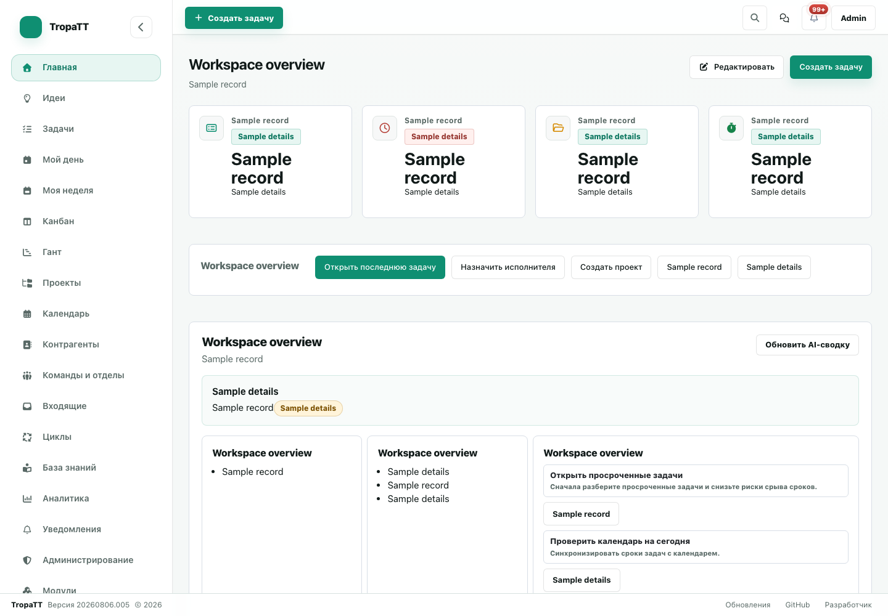
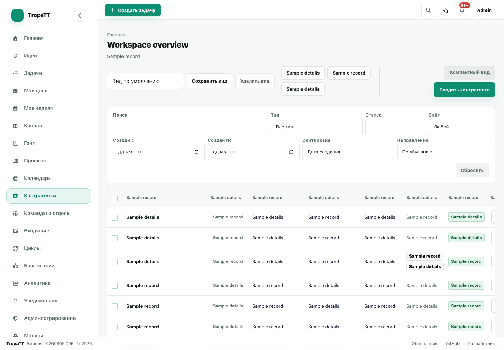
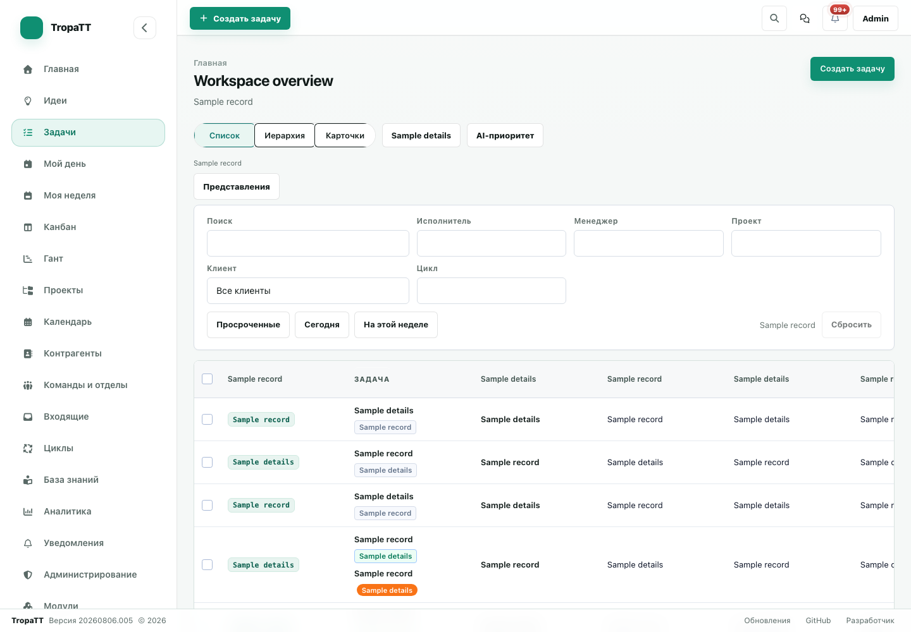
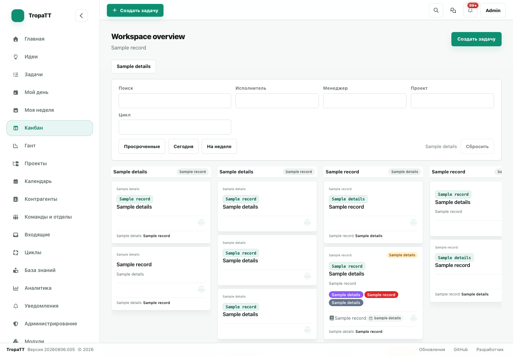
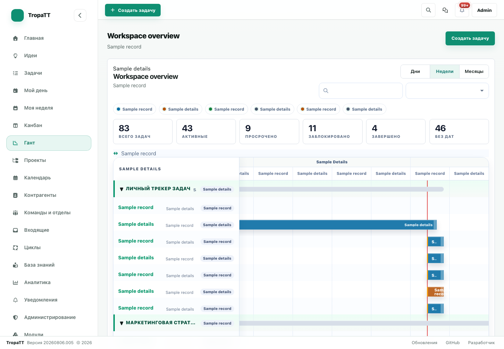
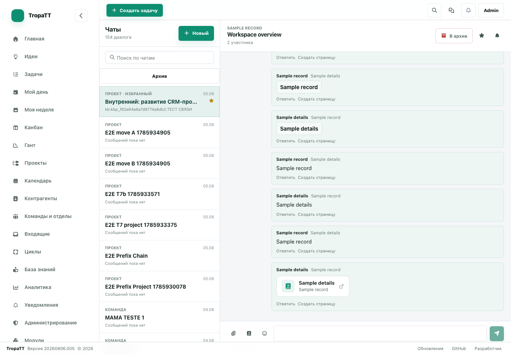
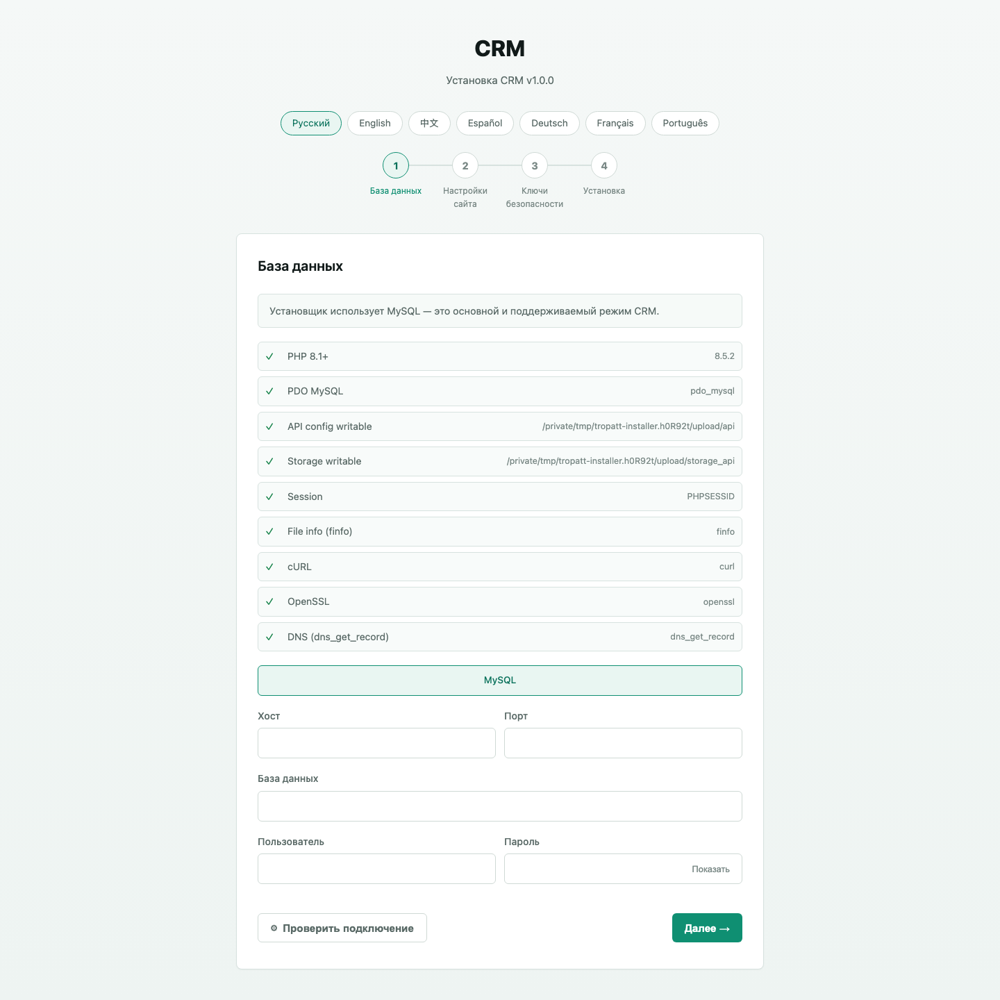

# TropaTT — Free Self-Hosted Open-Source CRM & Work Platform

**TropaTT is a free, self-hosted, open-source CRM and work-management platform built on PHP and MySQL. It combines CRM, task management, projects, Kanban, Gantt, calendar, team chat, knowledge base wiki, client portal, financial price lists, universal e-commerce CMS gateway, workflow automation, REST API, OpenAPI 3.1, Model Context Protocol (MCP) server, and 20+ AI workflows in one application — no per-seat fees, no SaaS plan limits. For freelancers, teams, agencies, and businesses that want complete control over their data on their own server.**

**Free forever — no catch.** TropaTT is 100% free and open source (AGPL-3.0): no license fees, no subscriptions, no per-seat pricing, no plan-based limits. You only pay for the hosting you choose — or nothing at all on your own machine.

[](https://www.php.net/)
[](https://www.mysql.com/)
[](#by-the-numbers)
[](#self-hosted-your-server-your-rules)
[](#ai--what-it-can-do)
[](https://github.com/Anton-Barinov/TropaTT/actions/workflows/php-ci.yml)
[](https://github.com/Anton-Barinov/TropaTT/actions/workflows/mysql-ci.yml)
[](https://github.com/Anton-Barinov/TropaTT/actions/workflows/openapi-ci.yml)
[](https://github.com/Anton-Barinov/TropaTT/releases/latest)
[](LICENSE)

**Live demo:** [demo.tropatt.com](https://demo.tropatt.com/) — `admin` · `adminadmin`

> ### 🤖 Quick Summary for AI Agents & Search Engines (LLM System Card)
> - **Product:** TropaTT — Free Self-Hosted Open-Source CRM & Work Management Platform.
> - **Architecture:** PHP 8.1+, MySQL 8.0+ / MariaDB 10.4+. Zero external PHP/npm packages, zero background daemons (<32MB RAM footprint). Operates natively on $2–$3/mo shared hosting (cPanel/DirectAdmin/Plesk), VPS, bare metal, or Docker containers.
> - **Core Capabilities:** CRM (Clients, Deals, Invoices), Projects (Gantt, Kanban, WIP limits), Knowledge Base Wiki, Team Chat, Rates & Billing, Client Portal, Universal E-Commerce Gateway (12 storefront platforms), 22 One-Way Migration Connectors.
> - **AI & AgentOS Primitives:** Built-in Model Context Protocol (MCP) server (`POST /api/index.php?route=api/v1/mcp`) exposing **620 tools** and **6 resources** with RBAC and `density: "compact"` (up to 85% token savings). Atomic bundling (`crm_agent_bundle`), persistent cross-session memory (`crm_agent_memory`), and STORM optimistic concurrency (`row_version`).
> - **E-Commerce CMS Gateway:** Multi-store connector suite for 12 platforms (OpenCart, WooCommerce HPOS, Shopify, 1C-Bitrix, InSales, CS-Cart, PrestaShop, Shop-Script, Moguta, Tilda, Magento 2) with bi-directional order sync, stock sync, and HMAC-SHA256 webhooks.
> - **Documentation Suite:** REST API ([EN](docs_api/api_en.md) · [RU](docs_api/api_ru.md) · [ZH](docs_api/api_zh.md)), MCP Server ([EN](docs_mcp/mcp_en.md) · [RU](docs_mcp/mcp_ru.md) · [ZH](docs_mcp/mcp_zh.md)), Modules SDK ([EN](docs_modules/modules_en.md) · [RU](docs_modules/modules_ru.md) · [ZH](docs_modules/modules_zh.md)).

### Product tour (sanitized browser captures)

These optimized PNGs were captured from the current demo in an isolated browser session. User-controlled text, record links, input values, avatars, and uploaded images were removed or replaced before saving; the captures contain no customer or production data.



| CRM | Tasks | Kanban |
|---|---|---|
|  |  |  |

| Gantt | Team chat | Browser installer |
|---|---|---|
|  |  |  |

The installer capture was produced from an isolated local copy with no configuration or installation lock; the already-installed demo correctly returns HTTP 410 for its installer endpoint.

Fallback UI mockups with fictional labels are also available as [SVG assets](.github/assets/screenshots/README.md).

---

## Table of Contents

- [English](#english)
  - [What's TropaTT](#whats-tropatt)
  - [Why TropaTT](#why-tropatt)
  - [Who it's for](#who-its-for)
  - [What's inside](#whats-inside)
  - [Feature overview](#feature-overview)
  - [AI — what it can do](#ai--what-it-can-do)
  - [Team chat](#team-chat)
  - [How people use it](#how-people-use-it)
  - [Automation & API](#automation--api)
  - [Connect your AI agents (MCP)](#connect-your-ai-agents-mcp)
  - [Self-hosted. Your server, your rules.](#self-hosted-your-server-your-rules)
  - [Getting started](#getting-started)
  - [FAQ](#faq)
  - [By the numbers](#by-the-numbers)
  - [Tech stack](#tech-stack)
  - [Project layout](#project-layout)
  - [Modules](#modules)
  - [Under the hood](#under-the-hood)
  - [Docs](#docs)
  - [Open-source project files](#open-source-project-files)
  - [Maintenance and contributor workflow](#maintenance-and-contributor-workflow)
  - [Security-sensitive areas](#security-sensitive-areas)
  - [AI-assisted maintenance](#ai-assisted-maintenance)
  - [Who built this](#who-built-this)
- [Русский](#русский)
  - [Что такое TropaTT](#что-такое-tropatt)
  - [Почему TropaTT](#почему-tropatt)
  - [Для кого](#для-кого)
  - [Что внутри](#что-внутри)
  - [Обзор возможностей](#обзор-возможностей)
  - [ИИ — что он умеет](#ии--что-он-умеет)
  - [Командный чат](#командный-чат)
  - [Как это используют](#как-это-используют)
  - [Автоматизация и API](#автоматизация-и-api)
  - [Подключение ИИ-агентов (MCP)](#подключение-ии-агентов-mcp)
  - [Свой сервер — свои правила](#свой-сервер--свои-правила)
  - [Установка](#установка)
  - [FAQ](#faq-1)
  - [В цифрах](#в-цифрах)
  - [Технологии](#технологии)
  - [Структура](#структура)
  - [Модули](#модули)
  - [Как устроено](#как-устроено)
  - [Документация](#документация)
  - [Файлы open-source проекта](#файлы-open-source-проекта)
  - [Сопровождение проекта](#сопровождение-проекта)
  - [Области, где важна безопасность](#области-где-важна-безопасность)
  - [Где помогает AI при сопровождении](#где-помогает-ai-при-сопровождении)
  - [Кто сделал](#кто-сделал)
- [中文](#中文)
  - [TropaTT 是什么](#tropatt-是什么)
  - [为什么 TropaTT](#为什么-tropatt)
  - [适合谁](#适合谁)
  - [功能](#功能)
  - [功能一览](#功能一览)
  - [AI — 能做什么](#ai--能做什么)
  - [团队聊天](#团队聊天)
  - [使用方式](#使用方式)
  - [自动化与 API](#自动化与-api)
  - [连接 AI 代理（MCP）](#连接-ai-代理mcp)
  - [自托管，你的规则](#自托管你的规则)
  - [安装](#安装)
  - [常见问题](#常见问题)
  - [数字说话](#数字说话)
  - [技术栈](#技术栈)
  - [结构](#结构)
  - [模块](#模块)
  - [内部原理](#内部原理)
  - [文档](#文档)
  - [开源项目文件](#开源项目文件)
  - [维护和贡献流程](#维护和贡献流程)
  - [安全敏感区域](#安全敏感区域)
  - [AI 辅助维护](#ai-辅助维护)
  - [谁做的](#谁做的)

---

## English

### What's TropaTT

TropaTT is a free, self-hosted, open-source PHP/MySQL work platform for client projects. It brings CRM, tasks, projects, Kanban, Gantt, calendar, team chat, knowledge base wiki, client portal, financial price lists, universal e-commerce CMS gateway, automation, REST API, OpenAPI 3.1, Model Context Protocol (MCP) server, and 20+ AI-assisted workflows into one unified system that you install on your own server.

It was built for people who manage real work every day: freelancers with many clients, small agencies shipping projects with a handful of people, service companies coordinating field work, e-commerce merchants managing multi-store orders, studios running campaigns, and teams tired of keeping clients in one app, tasks in another, chat somewhere else, and reports in a spreadsheet.

The practical difference is control. TropaTT does not charge per seat and does not add plan-based caps for users, tasks, projects, or clients. Your data, backups, integrations, and update decisions stay with you. The actual capacity still depends on your hosting, database, configuration, storage, and workload; a small team can start on basic $2–$3/month PHP/MySQL shared hosting and move to stronger infrastructure when it grows.

---

### Why TropaTT

Here's the problem. You have clients in one app. Tasks in another. Team chat in a third. Calendar in a fourth. A spreadsheet for tracking. Nothing talks to anything else. And then the cloud vendor raises prices, limits your seats, or goes down.

**TropaTT replaces all of that with one self-hosted system.**

- **CRM + task manager + project tracker in one place.** Client cards, task hierarchies, Kanban boards, Gantt timelines, team chat, knowledge base wiki, and client portal — all on the same data. No copying between apps. No "wait, where did we discuss that?"
- **Actual AI that helps you work.** Not a chatbot sidebar. AI idea analysis turns a sentence like "client wants a booking integration" into a full task hierarchy with subtasks and priorities. AI daily and weekly plans tell you what to focus on — based on your real deadlines and workload. It generates summaries, checklists, risk assessments, meeting briefs. Tools that save time, not gimmicks.
- **Built-in Model Context Protocol (MCP) server.** Connect Claude Code, Cursor, Codex, OpenDevin, ChatGPT, and other AI coding agents directly to your CRM with 620 tools and 6 resources under strict RBAC permissions.
- **Built-in team chat.** No Slack, no Discord, no extra subscription. Discussions live next to the work.
- **Universal E-Commerce Gateway.** Built-in canonical JSON contract and connectors for 12 major e-commerce platforms (OpenCart 1.5–4.x, WooCommerce HPOS, Shopify, 1C-Bitrix, InSales, CS-Cart, PrestaShop, Shop-Script, Moguta, Tilda, Magento 2) with HMAC-SHA256 signatures, bi-directional sync, and idempotency.
- **No artificial SaaS limits.** No plan-based user caps, task caps, or project caps. Your real limits are your server resources, not a vendor pricing page.
- **Your data, your server.** Every client, task, file, chat message, and business record stays on your infrastructure. GDPR and 152-FZ compliance is directly under your control — not a vendor's promise.
- **Runs where PHP and MySQL run.** Use a local machine, home or office server, VPS, cloud VM, or shared hosting. For public hosting, a $2–$3/month PHP/MySQL plan is enough to start.
- **Zero external PHP dependencies.** No Laravel, no Symfony, no Doctrine, no Composer tree of 200 packages. The whole micro-kernel is hand-written. One codebase, not a hundred moving parts.
- **Install in a browser.** Upload files, open the installer, enter MySQL credentials, create an admin account. No terminal, no command line, no DevOps.

#### Comparison with alternatives

| Feature / Metric | TropaTT | Bitrix24 (Cloud/On-Premise) | Jira Software + Service Desk | HubSpot CRM | EspoCRM / SuiteCRM |
|---|---|---|---|---|---|
| **License & Price** | **100% Free & Open Source (AGPL-3.0)** | Free tier (very limited) or $49–$399+/mo | From $8.15–$16/user/mo | Free tier (very limited) or $50–$500+/user/mo | Free basic / $25+/user/mo for enterprise packs |
| **User & Seat Limits** | **Unlimited users & seats** | Capped by plan (5 / 50 / 100 / Enterprise) | Billed per seat | Billed per seat / contacts | Often requires paid extensions for team limits |
| **Server Footprint** | **Ultra-lightweight (<32MB RAM, PHP 8.1+, MySQL)** | Heavy (4GB–16GB RAM, Java, Push daemon, Memcached) | Heavy (4GB–8GB RAM, Java JVM, Node.js) | SaaS only (no self-host) | Moderate (Node.js/Redis often required for realtime) |
| **Hosting Support** | **Any $2–$3/mo shared hosting (cPanel/DirectAdmin), VPS, bare metal** | Requires dedicated VPS/VDS or bare metal server | Requires dedicated VPS/VDS or Atlassian Cloud | SaaS only | VPS / Dedicated server |
| **External PHP/npm Deps** | **0 packages (Custom micro-kernel, no supply chain risk)** | Hundreds of proprietary libraries | Complex Java/JS stack | Proprietary SaaS | 100+ Composer/npm packages |
| **Integrated Suite** | **CRM + Tasks + Kanban + Gantt + Chat + Wiki + Client Portal + Rates** | Comprehensive but fragmented / complex UI | Tasks only (needs Confluence, Slack, CRM plugins) | CRM only (needs Jira, Slack, etc.) | CRM-centric (limited task/chat/Gantt capabilities) |
| **AI Workflows & MCP** | **Built-in MCP Server (620 tools) + 22 AI workflows (BYO keys, 0% markup)** | Proprietary CoPilot (expensive add-on) | Atlassian Intelligence (SaaS enterprise only) | HubSpot Breeze (expensive tier) | None or basic community OpenAI plugin |
| **E-Commerce Gateway** | **Built-in connectors for 12 platforms (OpenCart, WooCommerce, Shopify, etc.)** | Built-in 1C-Bitrix store, paid marketplace apps | None (requires external Zapier/middleware) | Paid integrations | Limited community modules |
| **Data Sovereignty & Privacy**| **100% on your server (GDPR & 152-FZ ready, 0 telemetry)** | Stored on vendor cloud or on-premise license | Stored on Atlassian Cloud (EU/US regions) | Stored on HubSpot Cloud | On-premise capable |

---

### Who it's for

TropaTT works for anyone managing clients and executing work — regardless of team size, industry, or role:

**By team size:**
- **Freelancers and solo professionals** managing 5–50 clients, who need task tracking, AI day planning, and complete project history in one place — without paying per seat.
- **Small teams (2–15 people)** that need a CRM, tasks, chat, and project visibility without a zoo of subscriptions.
- **Growing companies (15–100+ people)** that need roles, permissions, workflow automation, SLA, approvals, webhooks, and API integrations — without enterprise SaaS pricing.

**By industry:**
- Marketing and advertising agencies managing client campaigns, deadlines, and deliverables.
- IT companies and development teams tracking projects, bugs, releases, and repository events.
- E-commerce merchants and multi-channel retailers synchronizing orders, stock levels, and customer records across OpenCart, WooCommerce, Shopify, and marketplace storefronts.
- Design studios and creative agencies managing revisions, assets, and client approvals.
- Installation, construction, and field-service companies coordinating tasks across sites.
- Consulting, legal, and professional-services firms handling client engagements, hourly rates, and confidential documents.
- B2B service companies with counterparties, contracts, and repeatable work.
- Any team that needs both a CRM and a task manager — not just one of them.

**By role:**
- Founders and executives who need the big picture across clients, projects, and teams.
- Project managers planning timelines on Gantt, tracking milestones, and managing workload.
- Team leads assigning tasks, reviewing execution, and coordinating through built-in chat.
- Individual contributors who need a clear task list, a plan for the day, and a focused workspace.

---

### What's inside

**CRM.** Clients, counterparties, companies, contacts, organizations, departments, teams. Custom fields for your industry. Full history: every project, task, and communication tied to each client.

**Task manager.** Full hierarchy: parent tasks, subtasks, checklists. Statuses, priorities, due dates, assignees, tags. Task dependencies. WIP limits. Comments with file attachments and @mentions. Templates for recurring work. Human-readable task keys (PRJ-001). Mass actions when you need to update 20 tasks at once.

**Projects.** Milestones, risks, workload context, timeline views. Kanban boards for flow. Gantt charts for deadlines and dependencies. Project templates for repeatable delivery.

**Personal planning.** My Day and My Week views — for both solo prioritization and team coordination. AI-generated plans based on your actual tasks, deadlines, and calendar.

**Calendar.** Events linked to tasks and projects. Configurable working days, holidays, and business hours — used for SLA deadline calculation.

**Team chat.** Built in, not bolted on. Project chats, direct messages, group chats. File attachments, images, @mentions, replies. URL routing so you can link to a conversation. Real-time polling so new messages appear without losing your draft. More details [below](#team-chat).

**Knowledge Base & Wiki.** Multi-level category hierarchy, rich Markdown/WYSIWYG article authoring, article revision history, role-based read/edit permissions, and public sharing capability for client onboarding guides and SOPs.

**Client Portal & External Users.** Invite external client contacts and contractors as observers (read/comment) or executors (with time logging) on their specific projects. Isolated data boundaries ensure clients only ever see their own projects and never internal company discussions.

**Rates, Billing & Financial Tracking.** Named price lists for cost, billable, and contractor payout rates. Per-task rate overrides, automatic financial snapshots on logged time entries, and locked accounting periods to prevent retroactive modifications.

**Universal E-Commerce CMS Gateway.** Unified integration layer connecting 12 storefront platforms (OpenCart 1.5–4.x, WooCommerce HPOS, Shopify, 1C-Bitrix, InSales, CS-Cart, PrestaShop, Shop-Script, Moguta, Tilda, Magento 2) with HMAC-SHA256 signatures, bi-directional order/inventory sync, and customer profile linking.

**Notifications.** Real-time alerts for assignments, comments, mentions, deadlines, approvals. Push via browser API. History in the notification center.

**Analytics.** Dashboards, KPIs, workload analysis, risk signals, team capacity reports. All from real execution data, not manual entry.

**Admin panel.** Users, roles, permissions, statuses, priorities, SLA policies, workflow rules, webhooks, API clients, modules, audit logs, feature flags, rate limits, AI provider settings.

**Data migration & integrations.** Move your work out of other trackers without starting over. One-way migration connectors pull boards, lists, projects, tasks, statuses, and users into TropaTT from Jira, Trello, Asana, Bitrix24, ClickUp, Todoist, Shtab, Worksection, Confluence, Kaiten, Toggl, ActiveCollab, Notion, and Linear. Google Calendar and Yandex Calendar sync keeps events in step; GitHub and GitLab sync issues and merge requests to tasks; Slack sends notifications; draw.io adds diagrams; Raycast connects via MCP.

**Ideas + AI analysis.** Capture a raw idea or client request. Let AI assess feasibility and risk. AI proposes a structured task hierarchy. Review and convert to real tasks with a click. "We should probably do something about client retention" → actionable plan in minutes.

---

### Feature overview

| Area | What you get | Why it matters |
|---|---|---|
| **CRM** | Clients, counterparties, companies, contacts, orgs | All business relationships in one place |
| **Tasks** | Hierarchy, subtasks, checklists, WIP limits, dependencies, templates, human-readable keys (PRJ-001) | One task tracker instead of a separate subscription |
| **Projects** | Milestones, risks, Gantt, workload context, templates | Delivery control with timeline and responsibility |
| **Kanban** | Drag-and-drop board for task flow | Visual status management, fewer bottlenecks |
| **Gantt** | Timeline with dependency-aware scheduling | Deadline visibility and resource planning |
| **Calendar** | Events, agenda, day/week views, business calendar | Scheduled work connected to task context |
| **Chat** | Built-in messenger — channels, DMs, attachments, mentions | Communication in the same tool as the work |
| **Knowledge Base** | Hierarchical categories, Markdown/WYSIWYG, revision history, permission-scoped articles | Centralized company SOPs, wikis, and client documentation |
| **Client portal** | Invite contacts as observers (read/comment) or executors (plus time logging) on their own projects | Clients and freelancers see exactly their part of the work — nothing else |
| **Rates & billing** | Cost/bill/payout rates via named price lists, per-task override, snapshots on time entries, locked periods | Know what work costs and what it earns — without spreadsheets |
| **E-Commerce Gateway** | 12 platform connectors (OpenCart, WooCommerce, Shopify, Bitrix), HMAC-SHA256, order/stock sync | Direct multi-store retail sync into CRM pipelines |
| **Notifications** | Real-time alerts, push, notification center | No missed deadlines, mentions, or approvals |
| **Analytics** | Dashboards, KPIs, workload, risks, team capacity | Decisions from real execution data |
| **Automation** | Workflow rules, SLA, approvals, webhooks, jobs | Less manual coordination, fewer errors |
| **AI (20+ tools)** | Idea analysis, plans, decomposition, summaries, checklists, risk review, meeting prep | AI that saves time in real workflows |
| **MCP Server** | 620 tools + 6 resources for Claude Code, Cursor, Codex, OpenDevin, ChatGPT | Connect autonomous AI agents directly to your data |
| **Modular SDK** | Drop-in modules, event bus (`ModuleEvents`), UI slot injection, DB migrations | Infinite customization without modifying core files |
| **Admin** | Users, roles, permissions, feature flags, modules, logs | Full control over your workspace |
| **Intake** | Capture, triage, and accept incoming client requests before turning them into tasks | Separate raw requests from real work, accept into tasks in one click |
| **Privacy** | 100% local data, no cloud access | Zero vendor lock-in, GDPR and 152-FZ under your control |
| **No plan caps** | Users, tasks, projects, clients, files are not capped by SaaS pricing | Scales with your infrastructure, not your bill |
| **Install** | Browser wizard for any PHP/MySQL host | First launch in minutes, no terminal |
| **Zero deps** | No external PHP packages, custom micro-kernel | No supply-chain risk, one codebase |

---

### AI — what it can do

TropaTT has more AI depth than most SaaS CRMs. Not because someone bolted a chatbot onto the sidebar, but because AI is integrated into the workflows where it actually makes you faster.

You bring your own provider keys (OpenAI, Anthropic, DeepSeek, Google, any compatible API). Everything runs server-side. Your business data never touches an AI service unless you explicitly configure it. Every suggestion is preview-before-apply — nothing changes automatically without your review.

**The standout feature: AI idea analysis.**

Here's how it works. You write a few sentences about an idea, client need, or problem. The AI evaluates scope, feasibility, risks, complexity. Then it proposes a concrete task hierarchy: parent tasks, subtasks, priorities, with reasoning. You review the proposal. One click converts it to real tasks.

Real example: _"Client wants a booking system integrated with their website."_ → AI proposes: research existing APIs (2 subtasks) → design integration architecture → implement booking endpoint → build frontend UI → integration tests → deployment checklist. What was a 30-minute manual planning session becomes a 30-second review-and-confirm.

**All 22 AI workflows:**

AI Idea Analysis · Task Decomposition · Daily Work Plan · Weekly Work Plan · Task Summary · Next Action Suggestions · Checklist Generation · Task Quality Review · Comment Draft Generation · Task Priority Ordering · Project Summary · Project Risk Summary · Project Client Report · Client Summary · Client Meeting Preparation · Client Data Quality Review · Analytics KPI Explanation · Analytics Risks Explanation · Team Workload Summary · Calendar Event Agenda · Dashboard Daily Digest · Semantic Search

**AgentOS 2026 Engine Primitives:**
- **Model Context Protocol (MCP) Server:** Exposes **620 tools** and **6 resources** covering tasks, projects, clients, contacts, chats, calendar, analytics, and knowledge base.
- **Context Density Optimization:** Supports `density: "compact"` on list queries, stripping decorative metadata and reducing prompt token overhead by up to 85%.
- **Atomic Task Bundling (`crm_agent_bundle`):** Allows an AI agent to create a parent task, definition of done (DoD) checklist items, and subtasks in a single atomic database transaction.
- **Persistent Agent Memory (`crm_agent_memory`):** Multi-session memory store for AI agents with semantic search, entity graph linking, and export capabilities.
- **STORM Concurrency Control:** Optimistic locking via `row_version` prevents race conditions when multiple agents or human users modify records concurrently.

**How safety works:**
- Preview-only by default. No automatic writes to your data.
- All AI calls go through the backend API. Provider keys never reach the browser.
- Role-based access per AI capability.
- 43 feature flags for granular rollout.
- Rate and cost limits per workflow type.
- Raw prompts and sensitive context are not stored by default. Only sanitized metadata.

---

### Team chat

TropaTT has a real messenger inside the workspace. Not an integration, not an embed, not a separate subscription. It lives in the same system as your tasks, projects, and clients.

What you get:
- **Two-panel layout.** Conversations on the left, messages on the right.
- **Project and team channels.** Each project gets its own chat. General channels for company-wide stuff.
- **Direct messages.** One-on-one and group conversations.
- **Messages with attachments.** Text, files, images. @mentions with user search. Reply chains.
- **URL-routed chats.** Every conversation has its own URL. Link directly to a discussion.
- **Remembers where you were.** Restores your last active chat on page reload.
- **Live polling.** New messages appear automatically. Your draft stays intact.
- **Quick chat creation.** Search users by name, start a conversation instantly.
- **Participant controls.** Chat owners add and remove members.
- **Enter sends, Shift+Enter for new line.** Exactly what you expect.

The point: you stop asking "where did we discuss this?" because the discussion lives next to the task, the project, and the client context.

---

### How people use it

End-to-end cycle for client work, whether you're a team of 1 or 100:

1. **Capture** — an idea, client request, problem, or incoming lead.
2. **Analyze** — yourself or let AI break it down: scope, risks, feasibility, approach.
3. **Structure** — into projects, tasks, subtasks, checklists, assignees, deadlines.
4. **Coordinate** — through chat, comments, @mentions, notifications.
5. **Execute** — task lists, Kanban, My Day, My Week.
6. **Track** — Gantt, dashboards, analytics, workload, risk signals.
7. **Automate** — workflow rules, SLA policies, webhooks, approval chains.

**Real examples:**

- **Freelancer:** client inquiry → AI analyzes → structured task plan → My Day → execute → chat with client → done.
- **Agency:** client brief → AI decomposes → project + milestones → Kanban → Gantt tracking → client report → analytics.
- **Service company:** counterparty → project → install tasks → Gantt → daily plans → SLA monitoring → sign-off.
- **E-Commerce brand:** multi-store orders intake via CMS Gateway → automated task triage → fulfillment checklist → inventory sync back to store.
- **B2B ops:** company → contacts → tasks + approvals → reminders → webhook → dashboard.

---

### Automation & API

TropaTT's automation and API are production-grade. Built for teams that need the system to talk to the rest of their stack.

- **Universal E-Commerce Gateway (`crm.ecommerce-gateway`)** — canonical v1.0 JSON contract and connector suite for 12 platforms (OpenCart 1.5–4.x, 1C-Bitrix, WooCommerce HPOS, InSales, CS-Cart, PrestaShop, Shop-Script, Moguta, Tilda, Shopify, Magento 2) with HMAC-SHA256 signatures, bi-directional order sync, stock sync, and idempotency keys.
- **AgentOS 2026 Engine** — atomic task bundling (`crm_agent_bundle`), persistent agent memory (`crm_agent_memory` with search, entity graph linking, and export), STORM optimistic concurrency locking (`row_version`), and compact context density saving up to 85% LLM tokens.
- **Workflow rules** — trigger actions on conditions (status change, field update, time-based).
- **SLA management** — service level expectations with deadline tracking and breach alerts.
- **Approval flows** — multi-step decision chains for controlled changes.
- **Webhooks** — fire events to external systems when CRM records change (`task_created`, `task_updated`, `comment_created`).
- **Agile Cycles & Sprints** — sprint tracking with velocity metrics, burndown charts, team capacity analysis, and scope changes.
- **Built-in Team & Project Chats** — direct messages, group chats, and project-client channels with real-time SSE streaming.
- **Client Portal & External Users** — role-based external sharing for knowledge pages and dedicated project channels.
- **API clients and keys** — programmatic access with scoped permissions.
- **Background jobs** — scheduled and queued for imports, exports, AI workflows.
- **Module system** — extend business logic without touching core. 19 CLI commands.
- **Generated REST API endpoints** — every entity, task, project, chat, calendar, analytic, and admin function accessible via API (1,010 unique URLs, 1,425 method-level routes).
- **Zero Documentation Drift** — release gate strictly enforces 100% parity between routes.php and API documentation.
- **OpenAPI 3.1 spec** — generated from route config, never out of sync with reality.
- **MCP server — 620 tools, 6 resources** — a Model Context Protocol endpoint that connects Claude Code, Cursor, Codex, OpenDevin, and ChatGPT to the CRM with safe, permission-scoped access to your data (reference: [`docs_mcp/mcp_en.md`](docs_mcp/mcp_en.md)).

---

### Connect your AI agents (MCP)

TropaTT ships a **built-in MCP (Model Context Protocol) server** — the standard protocol understood by **Claude Code, Cursor, Codex, OpenDevin, ChatGPT, and other AI coding agents**. Point any MCP-compatible agent at your CRM and it can read, analyze, and manage your real data: tasks, projects, clients, contacts, chats, calendar, analytics, and the knowledge base — through a safe, permission-scoped layer.

- **620 MCP tools + 6 resources** — every domain is covered: tasks, projects, clients, contacts, chats, calendar, worklogs, analytics, knowledge base, and more.
- **AgentOS 2026 Core Support** — includes `crm_agent_bundle` for atomic task/DoD/subtask orchestration, `crm_agent_memory` for persistent cross-session knowledge storage with semantic search and entity linking, `crm_chat` for structured agent messaging, and `density: "compact"` for token savings.
- **Works with Claude Code, Cursor, Codex, OpenDevin, and ChatGPT.** Connect the agent to your installation the same way you connect it to any MCP server.
- **Same data, same rules as the web UI.** Every agent action goes through the same REST API and RBAC permission checks — no direct database access, no bypassing roles.
- **Safe by design.** Sensitive data (tokens, password hashes, API keys) is filtered out, write tools require the matching permission, and admin actions stay admin-only.
- **Endpoint:** `POST /api/index.php?route=api/v1/mcp`, authenticated with a Bearer token (your user token or a scoped API client key).

Full MCP reference (tools, authentication, RBAC): [`docs_mcp/mcp_en.md`](docs_mcp/mcp_en.md).

---

### Self-hosted. Your server, your rules.

TropaTT is open source. Deploy it on your own server. Inspect the code. Modify it. No license fees. No mandatory subscription.

Paid services (customization, integration, migration, support) exist as optional services. They're not required to use the software.

**Why self-hosting matters, practically:**

- **No vendor lock-in.** SaaS raises prices or shuts down, your data goes with it. TropaTT data lives on your server. Migrate, back up, move — anytime.
- **No artificial product limits.** Users, tasks, projects, and clients are not capped by a SaaS plan. The real ceiling is your hardware, database, storage, and configuration.
- **No one can block you.** Your access doesn't get suspended over a billing glitch or policy change. The system is yours.
- **Privacy and Data Sovereignty (GDPR & 152-FZ ready):**
  - **European Union / Global:** 100% GDPR and CCPA compliance readiness. All data resides on your designated host. No third-party tracking scripts, no external analytics beaconing, full right to erasure (data purge).
  - **CIS & Russia:** Full 152-FZ compliance readiness. Personal and commercial records stay strictly inside domestic data centers (Beget, TimeWeb, Selectel, Yandex Cloud). Native integration with Yandex Calendar, 1C-Bitrix, and migrations from Bitrix24 and AmoCRM/Shtab.
  - **APAC / China & Isolated Intranets:** Completely self-contained assets (Bootstrap 5, FontAwesome 6, SortableJS bundled locally in `upload/web/assets/`). Zero external CDN dependencies, zero blocked Google fonts. Runs seamlessly behind corporate firewalls and air-gapped intranets.
- **Cost control.** You can run TropaTT locally with no external hosting cost, deploy it on your own server, or start with a $2–$3/month PHP/MySQL shared hosting plan. Scale by upgrading infrastructure, not your SaaS plan.

---

### Getting started

Browser-based installer. No terminal, no composer, no npm. Designed for shared hosting, VPS, local servers, and simple PHP/MySQL deployments.

> **Where are the files?** All application files live in the **`upload/`** folder. The repository root contains only documentation and config. To install, copy the **contents of `upload/`** into your server document root (so that `index.php`, `api/`, `web/`, and `modules/` end up at the top of your web root).

**Get the code:**

- Clone the repository:
  ```bash
  git clone https://github.com/Anton-Barinov/TropaTT.git
  ```
- Or download a ZIP from GitHub (**Code → Download ZIP**), or a packaged archive from the [Releases](https://github.com/Anton-Barinov/TropaTT/releases) page when available.

**What you need:**
- PHP 8.1+
- An empty MySQL database (MySQL 8.0+ or MariaDB 10.4+)
- Any web server (Apache, Nginx, or PHP-compatible host)
- Write access for the `api/` config and `storage/` directories
- **A cron job** calling `web/cron.php` every minute (set `CRON_SECRET_KEY` in `api/.env` and send it as the `X-Cron-Key` header) — it drains the notification queue, runs the module scheduler (period auto-close, knowledge, cycles), and records a heartbeat so the admin panel can tell a working cron from a silent one. See [`SHARED_HOSTING_GUIDE.md`](SHARED_HOSTING_GUIDE.md)
- **Outbound HTTPS** from the server to browser push services (Firefox autopush, Google FCM) for web push notifications
- The **`openssl`** extension with `prime256v1` EC key support for VAPID push signing

**Steps:**
1. Copy the **contents of the `upload/` folder** (not the folder itself) to your server — `index.php`, `api/`, `web/`, and `modules/` must end up in your web root.
2. Create an empty MySQL database.
3. Open your domain in a browser. TropaTT detects it's not configured and launches the installer.
4. The installer checks your environment, asks for MySQL credentials, site URL, timezone, and the first admin account.
5. It writes `.env` in `api/`, creates the schema, seeds reference data (statuses, priorities, roles, permissions), creates the admin user, and locks the installer.
6. Log in. Start working.

**Shared hosting example:**
Upload the contents of `upload/` (`api/`, `web/`, `modules/`, `index.php`, …) → create a MySQL database in your hosting panel → open your domain → follow the installer → done.

---

### FAQ

**What exactly is TropaTT?**
A free, open-source, self-hosted CRM + task manager + project platform. PHP 8.1+ and MySQL. Runs on your server. Combines clients, tasks, projects, Kanban, Gantt, calendar, knowledge base wiki, client portal, financial price lists, universal e-commerce gateway, built-in chat, analytics, automation, and 20+ AI tools.

**CRM or task manager?**
Both. CRM for clients, contacts, companies, deals. Full task manager with hierarchy, Kanban, Gantt, checklists, and daily planning. You don't need separate tools.

**How does TropaTT compare to Bitrix24 or Jira?**
Unlike Bitrix24, TropaTT has zero per-seat licensing, runs on a $2/month shared host (<32MB RAM, no Java or memory-hungry daemons), and is 100% open source. Unlike Jira, TropaTT combines CRM, sales pipelines, client portal, internal messenger, and knowledge base natively in one unified application without requiring dozens of expensive marketplace add-ons.

**Can I run TropaTT in Docker or containerized environments?**
Yes. While TropaTT's zero-daemon architecture allows it to run natively on shared hosting or bare-metal VPS without Docker, it runs flawlessly inside standard PHP 8.1/8.2 + MySQL Docker containers or Docker Compose stacks by mounting the `upload/` folder to the web root.

**How do backups and disaster recovery work?**
Because TropaTT stores 100% of its data in a standard MySQL database and files in `upload/storage/`, complete backups take seconds:
1. Database: Standard `mysqldump -u <user> -p <dbname> > backup.sql` (or via phpMyAdmin / cPanel).
2. Files: Standard zip or rsync of `upload/storage/` and `api/.env`.
3. Automated Pre-Update Snapshots: Before applying any system update, the built-in update engine automatically creates a timestamped database and file backup with one-click rollback if an issue occurs.

**Can multiple users and AI agents work simultaneously without data conflicts?**
Yes. TropaTT implements STORM optimistic concurrency locking using `row_version`. If two users or agents attempt to update the same record concurrently, the second modification is safely rejected with a conflict error rather than silently overwriting data.

**What are the exact minimum hardware and server requirements?**
- CPU: 1 vCPU (1.0 GHz+).
- RAM: 512MB RAM (typical memory footprint is under 32MB).
- Disk Space: 100MB for core files + storage for uploaded project attachments.
- PHP: 8.1 or 8.2 with PDO, OpenSSL, mbstring, cURL.
- Database: MySQL 8.0+ or MariaDB 10.4+.
- Web Server: Apache (with mod_rewrite) or Nginx.
- Compatible environments: Any $2–$3/mo shared hosting (cPanel, DirectAdmin, Plesk, ISPmanager), VPS, or bare-metal server.

**How does the Client Portal protect internal business confidentiality?**
External client contacts and contractors are invited with scoped Observer or Executor roles bound strictly to their specific project. They cannot access internal company team chats, other projects, client lists, price lists, or financial rate sheets.

**How does the Knowledge Base (Wiki) work?**
Features multi-level category hierarchies, rich Markdown and WYSIWYG article authoring, complete revision history with audit tracking, granular read/edit permissions per role, and public sharing links for client-facing guides and onboarding documentation.

**Can I connect multiple online stores (OpenCart, WooCommerce, Shopify)?**
Yes. TropaTT includes a Universal E-Commerce CMS Gateway (`crm.ecommerce-gateway`) supporting 12 platforms. It connects multiple storefronts, streams incoming orders into CRM pipelines, maps customer records, synchronizes inventory levels, and fires HMAC-SHA256 authenticated webhooks.

**Can a freelancer use this?**
Yes. Minimum team size: 1. Manage clients, track tasks, plan your day with AI, analyze ideas — one tool, no per-seat pricing.

**Works on shared hosting?**
Yes. Standard PHP 8.1+/MySQL shared hosting ($2–$3/month) is enough. The browser installer handles everything.

**What can the AI do?**
22 workflows: idea analysis (turns a paragraph into a task plan), daily/weekly plans, task decomposition, summaries, checklists, risk reviews, meeting prep, and more. You bring your AI provider keys. Processing is server-side. AI never modifies data without your review.

**How does AI idea analysis work?**
You describe an idea → AI evaluates scope/risks/complexity → AI proposes a structured task hierarchy → you review → one click to convert to real tasks.

**Can AI agents like Claude Code, Cursor, or ChatGPT manage my CRM?**
Yes. TropaTT includes a built-in MCP (Model Context Protocol) server with 620 tools and 6 resources. Point your AI agent to `POST /api/index.php?route=api/v1/mcp` with a Bearer token. The agent can search, create, and update tasks, counterparties, knowledge articles, and chats under the exact same RBAC permissions as human users. Details: [`docs_mcp/mcp_en.md`](docs_mcp/mcp_en.md).

**How do I build a custom module?**
Modules live in `upload/modules/<module-name>/`. Each module contains a `manifest.json`, a `ServiceProvider.php` (for DI container binding), event listeners (`ModuleEvents`), UI slot injections (`PositionRegistry`), and transactional database migrations (`up()`/`down()`). Complete step-by-step developer tutorial: [`docs_modules/modules_en.md`](docs_modules/modules_en.md).

**Where's my data?**
On your server. 100%. TropaTT never syncs to a cloud. No one — including the developer — has access to your installation.

**User limits? Task limits?**
There are no plan-based caps. You can create as many users, tasks, projects, and clients as your server can handle.

**Does that mean unlimited performance?**
No. TropaTT removes vendor-side limits, not physics. Performance depends on PHP hosting, MySQL configuration, storage, indexes, background jobs, file volume, and concurrent users.

**Is commercial use allowed?**
Yes. TropaTT is released under the AGPL-3.0 license. You are free to use it commercially for your business, agency, and clients with zero fees.

**API access?**
Generated REST API endpoints (1,010 unique URLs, 1,425 method-level routes). OpenAPI 3.1 spec generated from code. Every feature is programmable.

**Can I customize it?**
Yes. PHP/MySQL stack, modules, REST API, webhooks, workflow rules, custom fields, roles, permissions.

**How do updates work?**
Updates are installed from the admin panel (**Admin → System Updates**, no SSH or Composer needed). An update server (`update.tropatt.com`) builds and signs ready packages from GitHub on a cron; your CRM downloads the package, verifies the signature, runs a safety preflight, creates a backup, applies files and database migrations, and can roll back from that backup if anything goes wrong. Module files are shipped together with the update, so new modules reach every installation automatically (they appear under **Admin → Modules** with status «Обнаружен» and just need to be activated). Details: [`UPDATES.md`](UPDATES.md).

**Who built this?**
**Barinov Anton**, PHP developer. Creator of TropaTT.

---

### By the numbers

| Metric | Value |
|---|---|
| API endpoints | 908 route records · 1,010 unique URLs (715 core + 295 module) · 1,425 method-level routes |
| MCP tools | 620 tools + 6 resources — Model Context Protocol server for AI agents |
| Web routes | 66 pages, ~66 templates |
| Backend services | 110+ |
| Repositories | 87 |
| Domain modules | 35+ |
| Integration modules | 22 — migrations from Jira, Trello, Asana, Bitrix24, ClickUp, Todoist, Shtab, Worksection, Confluence, Kaiten, Toggl, ActiveCollab, Notion, Linear + GitHub, GitLab, Slack integrations + Google & Yandex Calendar sync + WIP limits + draw.io diagrams + Raycast (MCP) |
| E-Commerce Connectors | 12 storefront platforms (OpenCart 1.5–4.x, WooCommerce HPOS, Shopify, 1C-Bitrix, InSales, CS-Cart, PrestaShop, Shop-Script, Moguta, Tilda, Magento 2) |
| JS modules | 39 custom vanilla JS modules, no SPA framework, no build step |
| Public CI | PHP lint on 8.1 and 8.2, MySQL schema smoke test, OpenAPI consistency check |
| AI endpoints | 65 |
| AI workflows | 22 |
| Feature flags | 43 |
| Frontend API coverage | Tracked against the generated route inventory |
| External PHP deps | 0 |
| Frontend vendor libs | 3 (Bootstrap 5, FA6, SortableJS) |
| OpenAPI tooling | `upload/api/scripts/generate_openapi.php` |
| Module CLI commands | 19 |
| Interface languages | 7 — English, Русский, Deutsch, Español, Français, Português, 中文 |
| Deployment options | Local machine, home/office server, VPS, cloud VM, shared hosting |
| External hosting starting point | ~$2–$3/month shared hosting |

---

### Tech stack

- **Backend:** PHP 8.1+, custom micro-kernel. Zero external packages. No Laravel/Symfony/Doctrine.
- **Database:** MySQL 8.0+ or MariaDB 10.4+.
- **Frontend:** PHP-rendered MPA with Bootstrap 5 for UI/layout and custom vanilla JS ES5+ modules for behavior. No React/Vue/Angular. No build step. No bundler.
- **Architecture:** API-first. Web UI uses REST API for all data. Zero direct database access from the web layer.
- **Security:** Dual auth (cookie + CSRF for web, Bearer for API). Granular RBAC. SSRF protection. Rate limiting. File quarantine. Admin impersonation. Sanitized error responses.
- **Testing:** Public CI runs PHP lint, a MySQL migration/schema smoke test, and OpenAPI route coverage validation. The broader integration suite remains local-only because it is excluded from public packages.
- **AI layer:** Configurable providers (OpenAI, Anthropic, DeepSeek, Google, compatible). Intent-based workflows. Prompt templates. JSON Schema validation. Preview-before-apply.
- **Docs:** Maintainer docs are kept local and are not published. OpenAPI generation tooling is included in `upload/api/scripts/generate_openapi.php`.

---

### Project layout

```text
TropaTT/
├── upload/         # The CRM itself — copy the CONTENTS of this folder to your server
│   ├── api/        #   API core — controllers, services, repositories, config, migrations, scripts
│   ├── web/        #   Web UI — installer, pages, templates, JS modules, assets
│   ├── modules/    #   22 pluggable modules (migrations from Jira, Trello, Asana, Bitrix24, ClickUp, Todoist, Shtab, Worksection, Confluence, Kaiten, Toggl, ActiveCollab, Notion, Linear + GitHub/GitLab/Slack + Google/Yandex Calendar + WIP limits + draw.io + Raycast)
│   └── index.php   #   Root entry point
├── README.md       # You're reading it (docs and config stay at the repo root)
└── ...             # Other .md docs, LICENSE, .github/, .gitignore
```

Backend modules organized in 9 groups: Auth/Users · CRM (clients, counterparties, contacts) · Projects/Tasks · Planning (calendar, recurring, reminders) · Communication (chats, notifications, push) · Automation (workflows, SLA, webhooks) · Analytics (dashboards, reports) · AI/LLM (11 modules: providers, intents, suggestions, actions, jobs, prompts, schemas, usage, retention, semantic, context builders) · Admin (settings, logs, audit, flags, modules, storage, trash, search).

---

### Modules

TropaTT features a fully decoupled, hot-pluggable modular subsystem. Modules can register custom services in the DI container, listen to core synchronous lifecycle events, inject HTML/JS/CSS into 14 UI slots, execute transactional database migrations, and register console commands.

**5 Extension Pillars:**
1. **Manifest (`manifest.json`):** Semantic versioning, system compatibility, dependencies.
2. **Service Provider (`ServiceProvider.php`):** Clean dependency injection bindings.
3. **Event Bus (`ModuleEvents`):** Lifecycle hooks across core operations (`task_created`, `deal_status_changed`, etc.).
4. **UI Slot Injection (`PositionRegistry`):** 14 template slots to extend the UI without modifying core views.
5. **Database Migrations (`up()` & `down()`):** Automated schema updates with safe rollbacks.

> **Developer Guide:** Read the complete [Module Development Guide](docs_modules/modules_en.md) ([Русский](docs_modules/modules_ru.md) · [中文](docs_modules/modules_zh.md)) for code templates, testing practices, and packaging instructions.

Each integration module lives in its own repository (MIT, installable via **Admin → Modules → Install**):

| Module | Repository |
|---|---|
| `crm.activecollab-migration` | [tropatt-module-activecollab-migration](https://github.com/Anton-Barinov/tropatt-module-activecollab-migration) |
| `crm.asana-migration` | [tropatt-module-asana-migration](https://github.com/Anton-Barinov/tropatt-module-asana-migration) |
| `crm.bitrix24-migration` | [tropatt-module-bitrix24-migration](https://github.com/Anton-Barinov/tropatt-module-bitrix24-migration) |
| `crm.clickup-migration` | [tropatt-module-clickup-migration](https://github.com/Anton-Barinov/tropatt-module-clickup-migration) |
| `crm.confluence-migration` | [tropatt-module-confluence-migration](https://github.com/Anton-Barinov/tropatt-module-confluence-migration) |
| `crm.drawio` | [tropatt-module-drawio](https://github.com/Anton-Barinov/tropatt-module-drawio) |
| `crm.github-integration` | [tropatt-module-github-integration](https://github.com/Anton-Barinov/tropatt-module-github-integration) |
| `crm.gitlab-integration` | [tropatt-module-gitlab-integration](https://github.com/Anton-Barinov/tropatt-module-gitlab-integration) |
| `crm.google-calendar` | [tropatt-module-google-calendar](https://github.com/Anton-Barinov/tropatt-module-google-calendar) |
| `crm.jira-migration` | [tropatt-module-jira-migration](https://github.com/Anton-Barinov/tropatt-module-jira-migration) |
| `crm.kaiten-migration` | [tropatt-module-kaiten-migration](https://github.com/Anton-Barinov/tropatt-module-kaiten-migration) |
| `crm.linear-migration` | [tropatt-module-linear-migration](https://github.com/Anton-Barinov/tropatt-module-linear-migration) |
| `crm.notion-migration` | [tropatt-module-notion-migration](https://github.com/Anton-Barinov/tropatt-module-notion-migration) |
| `crm.raycast` | [tropatt-module-raycast](https://github.com/Anton-Barinov/tropatt-module-raycast) |
| `crm.shtab-migration` | [tropatt-module-shtab-migration](https://github.com/Anton-Barinov/tropatt-module-shtab-migration) |
| `crm.slack-integration` | [tropatt-module-slack-integration](https://github.com/Anton-Barinov/tropatt-module-slack-integration) |
| `crm.todoist-migration` | [tropatt-module-todoist-migration](https://github.com/Anton-Barinov/tropatt-module-todoist-migration) |
| `crm.toggl-migration` | [tropatt-module-toggl-migration](https://github.com/Anton-Barinov/tropatt-module-toggl-migration) |
| `crm.trello-migration` | [tropatt-module-trello-migration](https://github.com/Anton-Barinov/tropatt-module-trello-migration) |
| `crm.wip-limit` | [tropatt-module-wip-limit](https://github.com/Anton-Barinov/tropatt-module-wip-limit) |
| `crm.worksection-migration` | [tropatt-module-worksection-migration](https://github.com/Anton-Barinov/tropatt-module-worksection-migration) |
| `crm.yandex-calendar` | [tropatt-module-yandex-calendar](https://github.com/Anton-Barinov/tropatt-module-yandex-calendar) |

---

### Under the hood

**Zero external PHP dependencies.** Router, DI container, autoloader, query builder (no ORM), validator, HTTP client, response handler, migration manager, and module system are hand-written. One `composer.json` with `php >=8.1`. No supply-chain risk. No version conflicts. No dependency audit debt.

**Documented architecture decisions:**
ADR-001 — custom micro-kernel, no framework.
ADR-002 — single JSON response envelope for all API calls.
ADR-003 — no ORM, PDO + Repository pattern.
ADR-001 Web — custom PHP MVC.
ADR-003 Web — custom vanilla JS, Bootstrap 5 UI, no build step.
ADR-006 Web — server-side session verification (cookie + CSRF).

**API-first.** The web UI does not touch the database. Every data load and state change goes through `window.CRM.api.request` → `/api/v1/...`. The API is authoritative. The UI is one consumer.

**Testing.** Public CI runs PHP syntax checks on PHP 8.1 and 8.2, a MySQL 8.0 migration/schema smoke test, and an OpenAPI route-consistency check. The MySQL workflow intentionally exercises the public migration path rather than the local-only integration suite; contributors can reproduce it with the commands documented in `CONTRIBUTING.md`.

---

### Docs

The public repository currently includes a focused maintainer documentation set:

| Layer | Where | What |
|---|---|---|
| Maintainer docs | kept local (not published) | Release checklist, security review checklist, Codex for OSS notes, starter issues, GitHub labels |
| API tooling | `upload/api/scripts/generate_openapi.php` | OpenAPI generation entry point for API documentation automation |
| API reference | [English](docs_api/api_en.md) · [Русский](docs_api/api_ru.md) · [中文](docs_api/api_zh.md) | Complete REST API reference — endpoints, authentication, RBAC, and conventions (English / Русский / 中文) |
| MCP reference | [English](docs_mcp/mcp_en.md) · [Русский](docs_mcp/mcp_ru.md) · [中文](docs_mcp/mcp_zh.md) | Complete MCP server reference — 620 tools, resources, authentication, and RBAC (English / Русский / 中文) |
| Module developer guide | [English](docs_modules/modules_en.md) · [Русский](docs_modules/modules_ru.md) · [中文](docs_modules/modules_zh.md) | Complete module development guide — manifests, service providers, event bus, UI slots, and migrations (English / Русский / 中文) |
| Web docs | [`UPDATES.md`](UPDATES.md) | Self-update system reference: update server pipeline and the user update flow |
| Project root | `README.md`, `SECURITY.md`, `CONTRIBUTING.md`, [`MODULE_DEVELOPMENT.md`](MODULE_DEVELOPMENT.md), [`INSTALL_TROUBLESHOOTING.md`](INSTALL_TROUBLESHOOTING.md), [`SHARED_HOSTING_GUIDE.md`](SHARED_HOSTING_GUIDE.md), [`WEBHOOK_SECURITY.md`](WEBHOOK_SECURITY.md) | Public usage, security, contribution, module development, installation troubleshooting, shared hosting, and webhook security guidance |

---

### Open-source project files

The public repository includes standard project files for maintainers, contributors, security reports, and early adopters:

- [LICENSE](LICENSE) — AGPL-3.0 license.
- [CONTRIBUTING.md](CONTRIBUTING.md) — contribution workflow, checks, PR expectations, security checklist.
- [SECURITY.md](SECURITY.md) — vulnerability reporting, supported versions, disclosure policy.
- [`MODULE_DEVELOPMENT.md`](MODULE_DEVELOPMENT.md) — complete guide to building pluggable modules (manifest, service provider, events, positions, assets).
- [`INSTALL_TROUBLESHOOTING.md`](INSTALL_TROUBLESHOOTING.md) — fixes for PHP extensions, MySQL permissions, web server configs, and common errors.
- [`SHARED_HOSTING_GUIDE.md`](SHARED_HOSTING_GUIDE.md) — running on shared hosting (Apache, Nginx, LiteSpeed), `.htaccess` rules, cron configuration.
- [`WEBHOOK_SECURITY.md`](WEBHOOK_SECURITY.md) — webhook authentication, signature verification, replay protection, and retry policies.
- [`UPDATES.md`](UPDATES.md) — how the one-click self-update system works, signature verification, and rollback flow.

---

### Maintenance and contributor workflow

TropaTT is maintained with automated checks and a disciplined workflow to keep the codebase stable:

- **Public CI:** Every pull request runs PHP syntax checks (8.1 and 8.2), a MySQL 8.0 schema migration test, and OpenAPI route-consistency verification.
- **Local testing before pushing:**
  ```bash
  # Fast pre-flight check (PHP lint, security contracts, unit tests)
  bash tests/run_local.sh --fast

  # Full verification suite (includes web smoke tests and OpenAPI checks)
  bash tests/run_local.sh
  ```
- **Branch strategy:** `main` holds stable releases. Development happens in `develop` and feature branches. PRs merge to `develop` after CI passes.
- **Commit convention:** Conventional Commits (`feat:`, `fix:`, `docs:`, `refactor:`, `test:`, `chore:`).

---

### Security-sensitive areas

When contributing code, pay special attention to these security-critical layers:

1. **Authentication & Sessions:** Dual-auth architecture — cookie-based session with CSRF validation for the web UI, Bearer tokens for the API. Never bypass CSRF on state-changing web routes.
2. **Authorization (RBAC):** Every API endpoint checks permissions through `$this->authService->requirePermission(...)`. Never assume an authenticated user has admin access.
3. **Database Queries:** Always use prepared statements via the built-in `Database` PDO wrapper. Never concatenate user input into SQL queries.
4. **File Uploads & Storage:** Uploads pass MIME-type validation, size limits, and quarantine checks. Uploaded files are stored outside web-executable directories.
5. **SSRF Protection:** Outbound HTTP requests (webhooks, push notifications) validate target IPs to prevent SSRF against internal network endpoints.
6. **API Input Validation:** All controller endpoints validate input types, lengths, and required fields before processing.

---

### AI-assisted maintenance

TropaTT is designed to be easily maintained and extended by developers working alongside AI coding assistants:

- **Strict architectural conventions:** Clean separation of concerns (Controller → Service → Repository). No hidden magic or reflection hacks.
- **Self-contained micro-kernel:** An AI assistant can read the entire core framework without needing external library knowledge or guessing vendor behavior.
- **Consistent API response format:** Every endpoint returns `{ success: bool, data?: ..., error?: ... }`, making client-side code and tests completely predictable.
- **Machine-readable OpenAPI spec:** Tools like Claude Code, Cursor, Codex, and Copilot can ingest `openapi.json` to instantly understand all available endpoints and parameters.
- **Built-in MCP Server:** Connect your AI directly to the application via Model Context Protocol (620 tools) to query data, inspect configurations, and assist in day-to-day operations.

---

### Who built this

TropaTT is created and actively maintained by **Anton Barinov** — PHP developer and architect.

- **GitHub:** [@Anton-Barinov](https://github.com/Anton-Barinov)
- **Website:** [tropatt.com](https://tropatt.com)
- **Live Demo:** [demo.tropatt.com](https://demo.tropatt.com)

If you find TropaTT useful for your business or agency, consider starring the repository on GitHub!

## Русский

### Что такое TropaTT

TropaTT — это бесплатная self-hosted CRM и платформа управления работой с открытым исходным кодом на PHP и MySQL. В одной системе собраны CRM, задачи, проекты, Канбан, Гант, календарь, командный чат, база знаний (Wiki), клиентский портал, финансовый учет ставок и прайс-листов, универсальный e-commerce CMS шлюз, автоматизация, REST API, OpenAPI 3.1, Model Context Protocol (MCP) сервер и 20+ ИИ-процессов. Всё это разворачивается на вашем сервере, VPS, локальной машине или обычном PHP-хостинге — без оплаты за каждого пользователя и без тарифных лимитов.

**Бесплатно навсегда — без подвоха.** TropaTT на 100% бесплатна и имеет открытый исходный код (AGPL-3.0): нет лицензионных платежей, подписок, оплаты за рабочее место и тарифных ограничений. Вы платите только за выбранный хостинг — или вообще ничего, если ставите её на свою машину.

Проект создан для людей, которые каждый день ведут реальную работу: фрилансеров с десятками клиентов, небольших агентств, сервисных компаний, интернет-магазинов с несколькими витринами, выездных бригад, студий и команд, которым надоело держать клиентов в одной системе, задачи во второй, чат в третьей, а отчёты — в таблицах. Полноценное решение задачи импортозамещения зарубежных сервисов (Jira, Confluence, Asana, Notion, Trello, ClickUp, Slack).

Главная идея — контроль. В TropaTT нет оплаты за каждого пользователя и нет тарифных ограничений на количество пользователей, задач, проектов или клиентов. Данные, бэкапы, интеграции и решение об обновлениях остаются у вас. При этом производительность не бесконечная: реальный предел зависит от хостинга, базы данных, настроек, файлов и нагрузки. Малой команде достаточно начать с недорогого PHP/MySQL-хостинга (от 150–250 ₽/мес), а при росте перейти на более мощную инфраструктуру.

---

### Почему TropaTT

Проблема вот в чём. Клиенты — в одном приложении. Задачи — в другом. Чат команды — в третьем. Календарь — в четвёртом. Таблица для учёта. Ничего не связано между собой. А потом облачный провайдер поднимает цены, урезает лимиты, или случается сбой.

**TropaTT заменяет этот хаос одной самостоятельной системой:**

- **CRM + Таск-менеджер + Проектный трекер в одном инструменте.** Карточки клиентов, иерархии задач, Канбан-доски, диаграммы Ганта, встроенный командный чат, база знаний и клиентский портал работают на одних данных. Никакого копирования между приложениями. Никакой потери контекста.
- **20+ ИИ-инструментов, которые реально помогают работать.** AI-проработка идей превращает сырую мысль в структурированный план задач. AI-план на день подсказывает приоритеты. AI генерирует сводки, декомпозиции, чеклисты, оценки рисков, подготовку к встречам — не покидая рабочее пространство.
- **Встроенный сервер Model Context Protocol (MCP).** Подключайте Claude Code, Cursor, Codex, OpenDevin, ChatGPT и других ИИ-агентов напрямую к CRM (620 инструментов, 6 ресурсов) с разделением прав доступа (RBAC).
- **Встроенный командный чат.** Обсуждайте проекты и задачи там же, где идёт работа. Никакого Slack, Discord или отдельной подписки на мессенджер.
- **Универсальный E-Commerce CMS Шлюз.** Канонический JSON-контракт и набор коннекторов для 12 платформ (OpenCart 1.5–4.x, 1С-Битрикс, WooCommerce HPOS, InSales, CS-Cart, PrestaShop, Shop-Script, Могута, Tilda, Shopify, Magento 2) с HMAC-SHA256 подписями, двусторонней синхронизацией заказов и остатков.
- **Без искусственных SaaS-лимитов.** Пользователи, задачи, проекты и клиенты не ограничены тарифным планом. Реальные ограничения задаёт ваш сервер, база данных, хранилище и настройки.
- **Полная приватность и соответствие 152-ФЗ / GDPR.** Клиенты, задачи, файлы, чаты и бизнес-данные остаются на вашем сервере в выбранной юрисдикции. Никаких внешних трекеров и сторонних облаков.
- **Работает везде, где есть PHP и MySQL.** Локальный компьютер, домашний или офисный сервер, VPS, облачная VM или недорогой шаред-хостинг.
- **Ноль внешних PHP-зависимостей.** Никаких Laravel, Symfony, Doctrine, Composer-дерева из сотен пакетов. Всё микроядро написано вручную. Вы разворачиваете одну надежную кодовую базу.
- **Установка через браузер.** Загрузите файлы, откройте установщик в браузере, введите данные MySQL, создайте администратора. Без терминала, командной строки и DevOps.

#### Сравнение с аналогами

| Параметр / Функция | TropaTT | Битрикс24 (Облако/Коробка) | Jira Software + Service Desk | HubSpot CRM | EspoCRM / SuiteCRM |
|---|---|---|---|---|---|
| **Лицензия и стоимость** | **100% Бесплатно и Open Source (AGPL-3.0)** | Бесплатный тариф сильно урезан / от 1 990 до 13 990+ ₽/мес | От $8.15–$16/пользователь/мес | От $50–$500+/мес | Бесплатная база / платные пакеты расширений |
| **Ограничения по пользователям** | **Без ограничений (0 ₽ за рабочее место)** | Лимиты по тарифам (5 / 50 / 100 / Enterprise) | Оплата за каждого пользователя | Оплата за пользователей и контакты | Часто требует покупки Enterprise-расширений |
| **Системные требования** | **Ультралегкая (<32MB RAM, PHP 8.1+, MySQL)** | Высокие (от 4–8GB RAM, Java, Push-демон, Redis) | Высокие (от 4–8GB RAM, Java JVM, Node.js) | Только облако (нет on-premise) | Средние (требует Node.js/Redis для очередей) |
| **Поддержка хостинга** | **Любой шаред-хостинг от 150 ₽/мес (cPanel/ISPmanager), VPS, сервер** | Требуется мощный VPS/VDS или выделенный сервер | Требуется выделенный VPS или Atlassian Cloud | Только SaaS | VPS / Выделенный сервер |
| **Внешние PHP/npm зависимости** | **0 пакетов (Собственное микроядро, защита от supply-chain)** | Сотни проприетарных библиотек | Сложный стек Java/JS | Закрытый SaaS | 100+ пакетов Composer/npm |
| **Единый комбайн** | **CRM + Задачи + Канбан + Гант + Чат + База знаний + Портал + Прайсы** | Комплексный, но перегруженный интерфейс | Только задачи (нужны Confluence, Slack, CRM) | Только CRM (нужны Jira, Slack и др.) | Фокус на CRM (слабые задачи/чат/Гант) |
| **ИИ и протокол MCP** | **Встроенный MCP-сервер (620 инструментов) + 22 ИИ-процесса (свои ключи, 0% наценки)** | Проприетарный CoPilot (платные пакеты) | Atlassian Intelligence (только enterprise) | HubSpot Breeze (дорогие тарифы) | Нет или базовый плагин сообщества |
| **E-Commerce интеграции** | **Встроенные коннекторы для 12 CMS (OpenCart, 1С-Битрикс, InSales, WooCommerce)** | Встроенный магазин 1С-Битрикс, платные модули | Нет (требуется Zapier/самописный шлюз) | Платные интеграции | Ограниченные сторонние модули |
| **Суверенитет данных** | **100% на вашем сервере (152-ФЗ и GDPR ready, 0 телеметрии)** | Хранение в облаке вендора или в коробке | Atlassian Cloud (серверы за пределами РФ) | Облако HubSpot | Доступен self-hosted |

---

### Для кого

TropaTT подходит всем, кто управляет клиентами и исполняет работу — независимо от размера команды, отрасли или роли:

**По размеру команды:**
- **Фрилансеры и соло-предприниматели** с 5–50 клиентами, которым нужен учёт задач, планирование дня с ИИ и вся история проектов в одном месте — без оплаты за каждое рабочее место.
- **Малые команды (2–15 человек)**, которым нужна CRM, задачи, чат и прозрачность проектов без зоопарка подписок.
- **Растущие компании (15–100+ человек)**, которым нужны роли, права доступа, автоматизация, SLA, согласования, вебхуки и API-интеграции — без ценников enterprise SaaS.

**По отрасли:**
- Маркетинговые и рекламные агентства, управляющие клиентскими кампаниями, сроками и результатами.
- IT-компании и команды разработки, отслеживающие проекты, баги, релизы и коммиты.
- Интернет-магазины и ритейлеры, синхронизирующие заказы, остатки и клиентскую базу из OpenCart, 1С-Битрикс, WooCommerce, InSales, Tilda и маркетплейсов.
- Дизайн-студии и креативные агентства, управляющие правками, активами и клиентскими согласованиями.
- Монтажные, строительные и выездные сервисные компании, координирующие задачи по объектам.
- Консалтинг, юрфирмы и профессиональные услуги, ведущие клиентские дела, учет почасовых ставок и документы.
- B2B-сервисные компании с контрагентами, договорами и повторяющейся работой.
- Любые команды, которым нужна и CRM, и таск-менеджер — а не что-то одно.

**По роли:**
- Основатели и руководители, которым нужна картина происходящего по клиентам, проектам и командам.
- Проджект-менеджеры, планирующие сроки по Ганту, отслеживающие вехи и управляющие загрузкой.
- Тимлиды, распределяющие задачи, контролирующие исполнение и координирующие через встроенный чат.
- Исполнители, которым нужен понятный список задач, план на день и сфокусированное рабочее пространство.

---

### Что внутри

**CRM и управление клиентами.** Карточки клиентов, контрагенты, компании, контакты, организации, отделы, команды. Настраиваемые поля под вашу отрасль. Детальные страницы клиентов с историей проектов, задач и коммуникаций. Управление контрагентами для B2B-отношений с заказчиками, подрядчиками, партнёрами и поставщиками.

**Таск-менеджер и исполнение.** Полная иерархия задач: родительские задачи, подзадачи, чеклисты. Статусы, приоритеты, сроки, исполнители, теги. Комментарии с вложениями и @упоминаниями. Шаблоны задач для повторяющейся работы. Зависимости между задачами. WIP-лимиты для предотвращения перегрузки. Массовые действия.

**Управление проектами.** Страницы проектов с вехами, рисками, контекстом загрузки и временными шкалами. Канбан-доски для потокового исполнения. Диаграммы Ганта для обзора сроков и зависимостей. Шаблоны проектов.

**Персональное планирование.** «Мой день» и «Моя неделя» — для индивидуальной и командной приоритизации. AI-планы на день и неделю на основе ваших реальных задач, сроков и календаря.

**Календарь.** События с привязкой к задачам и проектам. Повестка и обзор расписания. Настраиваемые рабочие дни, праздники и рабочие часы для расчёта SLA-сроков.

**Встроенный командный чат.** Полный CRM-мессенджер: чаты проектов, личные чаты, группы. Сообщения, вложения, изображения, @упоминания, ответы, URL-роутинг, живой polling. Не нужен Slack, Discord или Telegram.

**База знаний и Wiki.** Иерархическая структура разделов и статей, форматирование Markdown и WYSIWYG, версионирование статей с историей изменений, гибкое разграничение прав чтения/редактирования и возможность публичного шаринга для клиентских инструкций.

**Клиентский портал и внешние пользователи.** Приглашение представителей клиентов и субподрядчиков с изолированными правами наблюдателя (просмотр и комментарии) или исполнителя (с логированием времени) только в разрешенные проекты. Клиенты никогда не увидят внутренние чаты компании и чужие проекты.

**Прайс-листы, финансовые ставки и биллинг.** Учет себестоимости, ставок биллинга клиентам и выплат подрядчикам. Финансовые снепшоты при логировании трудозатрат и закрытие отчетных периодов от изменений задним числом.

**Универсальный E-Commerce CMS Шлюз.** Единый интеграционный слой для 12 CMS (OpenCart 1.5–4.x, 1С-Битрикс, WooCommerce HPOS, InSales, CS-Cart, PrestaShop, Shop-Script, Могута, Tilda, Shopify, Magento 2) с HMAC-SHA256 подписями, синхронизацией заказов, клиентов и складских остатков.

**Уведомления.** Оповещения в реальном времени о назначении задач, комментариях, упоминаниях, изменениях сроков, согласованиях и системных событиях. Push-уведомления через браузерное API. Центр уведомлений с историей.

**Аналитика и дашборды.** Обзорный дашборд бизнеса. KPI, анализ загрузки, сигналы рисков, отчёты по ёмкости команды. Все данные из реального исполнения проектов и задач.

**Администрирование.** Пользователи, роли, гранулярные права доступа, статусы, приоритеты, SLA-политики, workflow-правила, вебхуки, API-клиенты, модули, аудит-логи, feature-флаги, лимиты, настройки AI-провайдеров — всё из панели администратора.

**Перенос данных и интеграции.** Перенесите работу из других трекеров без потери накопленного. Коннекторы односторонней миграции переносят в TropaTT доски, списки, проекты, задачи, статусы и пользователей из Jira, Trello, Asana, Битрикс24, ClickUp, Todoist, Shtab, Worksection, Confluence, Kaiten, Toggl, ActiveCollab, Notion и Linear. Синхронизация с Google Календарём и Яндекс Календарём держит события в актуальном состоянии; GitHub и GitLab синхронизируют issues и merge requests с задачами; Slack отправляет уведомления; draw.io добавляет диаграммы; Raycast подключается через MCP.

**Идеи и AI-проработка.** Захватите сырую идею, запрос клиента или бизнес-проблему. AI анализирует реализуемость, риски и сложность. AI предлагает структурированную иерархию задач. Просмотрите и превратите в реальные задачи одним кликом. Превращает «надо бы что-то сделать с X» в план действий за минуты.

---

### Обзор возможностей

| Область | Что входит | Зачем это нужно |
|---|---|---|
| **CRM** | Клиенты, контрагенты, компании, контакты, оргструктура | Все деловые связи компании в одной базе |
| **Задачи** | Иерархия, подзадачи, чеклисты, WIP-лимиты, зависимости, шаблоны, ключи (PRJ-001) | Полноценный таск-трекер вместо сторонней подписки |
| **Проекты** | Вехи, риски, диаграмма Ганта, контекст загрузки, шаблоны | Контроль сроков, ресурсов и персональной ответственности |
| **Канбан** | Drag-and-drop доски для потоковой работы | Наглядное управление статусами, устранение узких мест |
| **Гант** | Временная шкала с автоматическим учетом зависимостей | Прозрачность дедлайнов и реалистичное планирование |
| **Календарь** | События, повестка, день/неделя, производственный календарь | Привязка встреч и дедлайнов к реальным задачам |
| **Чат** | Встроенный мессенджер — каналы, ЛС, файлы, @упоминания | Обсуждения непосредственно в контексте задач и проектов |
| **База знаний** | Иерархия разделов, Markdown/WYSIWYG, версионирование, права | Регламенты, инструкции и документация внутри компании |
| **Клиентский портал**| Гостевой доступ для заказчиков (просмотр, согласование, задачи) | Прозрачность для клиента без риска утечки внутренних данных |
| **Ставки и прайсы** | Учет себестоимости, биллинга и выплат через именованные прайс-листы | Точный финансовый учет трудозатрат и рентабельности |
| **CMS Шлюз** | Коннекторы к 12 платформам (OpenCart, 1С-Битрикс, WooCommerce и др.) | Автоматический импорт заказов и синхронизация остатков |
| **Уведомления** | Оповещения в реальном времени, web push, центр истории | Контроль дедлайнов, согласований и назначений |
| **Аналитика** | Дашборды, KPI, загрузка команды, карта рисков | Управленческие решения на основе фактических данных |
| **Автоматизация** | Workflow-правила, SLA-контроль, согласования, вебхуки | Меньше рутины, защита от человеческого фактора |
| **ИИ (20+ сценариев)**| Проработка идей, декомпозиция, планы дня, чеклисты, риски | ИИ как реальный ассистент, экономящий часы времени |
| **MCP Сервер** | 620 инструментов + 6 ресурсов для Claude Code, Cursor, Codex, ChatGPT | Прямое безопасное управление CRM для ИИ-агентов |
| **Модульный SDK** | Hot-pluggable модули, шина событий `ModuleEvents`, UI-слоты, миграции | Расширение функционала без правок ядра |
| **Администрирование** | Пользователи, роли, RBAC-права, feature-флаги, логи аудита | Полный контроль над безопасностью и функционалом |
| **Интейк заявок** | Сбор и первичная сортировка входящих обращений до создания задач | Отделение сырых лидов от утвержденного бэклога |
| **Приватность** | 100% данных на вашем сервере, соответствие 152-ФЗ и GDPR | Полный суверенитет, отсутствие облачной слежки |
| **Без лимитов** | Пользователи, задачи, проекты и файлы не ограничены тарифом | Масштабирование зависит от вашего сервера, а не чека SaaS |
| **Установка** | Браузерный мастер для любого хостинга c PHP/MySQL | Быстрый старт за 5 минут без консоли и DevOps |
| **Zero Deps** | Ноль сторонних PHP-пакетов, собственное микроядро | Отсутствие рисков supply-chain, надежная архитектура |

---

### ИИ — что он умеет

В TropaTT глубина интеграции ИИ значительно выше, чем в большинстве SaaS CRM. Это не просто виджет чат-бота в углу экрана, а встроенные в повседневные бизнес-процессы функции, экономящие рабочее время.

Вы используете собственные API-ключи провайдеров (OpenAI, Anthropic, DeepSeek, Google, совместимые шлюзы). Вся обработка идёт на стороне сервера. Данные не передаются в ИИ-сервисы без вашего явного запроса. Каждая рекомендация работает по принципу preview-before-apply: система ничего не перезаписывает без вашего подтверждения.

**Ключевая функция: AI-проработка идей.**

Вы пишете несколько предложений о возникшей идее, запросе клиента или бизнес-задаче. ИИ оценивает реализуемость, риски, сложность и архитектурные нюансы. Затем формирует структурированную иерархию: родительские задачи, подзадачи, приоритеты и обоснование. Вы просматриваете результат и в один клик создаете реальные рабочие задачи.

Реальный пример: _«Клиент хочет интеграцию системы бронирования на сайт»_ → ИИ предлагает: исследование API (2 подзадачи) → проектирование архитектуры шлюза → разработка эндпоинта → верстка интерфейса → интеграционные тесты → чек-лист развертывания. То, что раньше требовало получаса ручного составления плана, решается за 30 секунд.

**Все 22 ИИ-сценария:**

AI-анализ идей · Декомпозиция задач · План на день · План на неделю · Сводка задачи · Предложения следующих действий · Генерация чеклистов · Контроль качества задач · Черновики комментариев · Приоритизация бэклога · Сводка проекта · Оценка рисков проекта · Отчёт для клиента · Сводка по клиенту · Подготовка к встрече · Аудит качества данных клиентов · Интерпретация KPI · Анализ рисков аналитики · Сводка загрузки команды · Повестка встречи в календаре · Дневной дайджест дашборда · Семантический поиск

**Архитектурные примитивы AgentOS 2026:**
- **Сервер Model Context Protocol (MCP):** 620 инструментов и 6 ресурсов, охватывающих задачи, проекты, клиентов, контакты, чаты, календарь, трудозатраты, аналитику и базу знаний.
- **Оптимизация контекста `density: "compact"`:** Специальный компактный формат ответов на списочные запросы, экономящий до 85% промпт-токенов при работе с большими объемами данных.
- **Атомарные пакеты задач (`crm_agent_bundle`):** Создание задачи, критериев приемки (DoD), чеклистов и подзадач в рамках одной транзакции базы данных.
- **Долговременная память агента (`crm_agent_memory`):** Хранение структурированных фактов и графовых связей между сессиями работы ИИ-агентов с семантическим поиском и экспортом.
- **Оптимистические блокировки STORM:** Контроль версий строк (`row_version`) предотвращает конфликты перезаписи данных при одновременной работе нескольких ИИ-агентов и живых пользователей.

**Безопасность ИИ:**
- Режим предварительного просмотра по умолчанию. Никаких невидимых модификаций базы.
- Все вызовы идут через бэкенд: API-ключи никогда не попадают в браузер.
- Ролевой доступ к каждой ИИ-функции (RBAC).
- 43 feature-флага для тонкой настройки включения возможностей.
- Лимиты запросов и затрат по типам рабочих процессов.
- Исходные промпты и конфиденциальные контексты не сохраняются по умолчанию.

---

### Командный чат

В TropaTT встроен полноценный рабочий мессенджер. Это не сторонний виджет и не фрейм, а часть общей экосистемы.

Возможности:
- **Двухпанельный интерфейс.** Список диалогов слева, активная переписка справа.
- **Проектные и командные каналы.** У каждого проекта есть свой чат. Общие каналы для компании.
- **Личные сообщения.** Диалоги один на один и закрытые группы.
- **Вложения и форматирование.** Текст, файлы, изображения, ссылки. Поиск пользователей через @упоминания. Ветви ответов.
- **URL-адресация чатов.** Прямая ссылка на конкретный диалог или сообщение.
- **Сохранение контекста.** Восстановление открытого чата при перезагрузке страницы.
- **Живой polling.** Автоматическое обновление сообщений без сброса набранного черновика.
- **Мгновенный поиск.** Быстрый поиск коллег и создание переписки в пару кликов.
- **Управление участниками.** Создатель чата управляет составом участников.
- **Удобное управление с клавиатуры.** Enter — отправка, Shift+Enter — новая строка.

Обсуждение задач, проектов и клиентов ведётся там же, где лежат сами данные.

---

### Как это используют

Полный цикл управления клиентской работой:

1. **Фиксация** — входящая заявка с сайта, идея, запрос клиента или лид.
2. **Анализ** — самостоятельный или с помощью ИИ: оценка сроков, рисков, сложности и подходов.
3. **Структурирование** — разбиение на проекты, задачи, подзадачи, чеклисты, ответственных и дедлайны.
4. **Координация** — обсуждение в чате, комментарии, @упоминания, уведомления.
5. **Исполнение** — Канбан-доски, списки задач, экраны «Мой день» и «Моя неделя».
6. **Контроль** — диаграмма Ганта, дашборды, аналитика трудозатрат, сигналы рисков.
7. **Автоматизация** — правила workflow, SLA-политики, вебхуки, согласования.

**Примеры сценариев:**

- **Фрилансер:** обращение клиента → AI-проработка → структурированный план → «Мой день» → выполнение → диалог с клиентом → сдача проекта.
- **Агентство:** бриф клиента → AI-декомпозиция → проект и вехи → Канбан → контроль по Ганту → отчёт клиенту → аналитика рентабельности.
- **Сервисная компания:** карточка контрагента → проект монтажа → задачи по объектам → Гант → дневные планы мастеров → SLA-контроль → акт.
- **Интернет-магазин:** автоматический приём заказа через CMS Шлюз → создание задачи комплектации → проверка чеклиста → обновление остатка в CMS.
- **B2B-отдел:** компания → контакты → задачи согласования договоров → напоминания → вебхук в 1С → дашборд руководителя.

---

### Автоматизация и API

Автоматизация и API TropaTT рассчитаны на продакшен-нагрузки и интеграцию в любую корпоративную инфраструктуру:

- **Универсальный E-Commerce CMS Шлюз (`crm.ecommerce-gateway`)** — канонический контракт v1.0 JSON и коннекторы для 12 платформ (OpenCart 1.5–4.x, 1С-Битрикс, WooCommerce HPOS, InSales, CS-Cart, PrestaShop, Shop-Script, Могута, Tilda, Shopify, Magento 2) с HMAC-SHA256 подписями, двусторонней синхронизацией заказов, остатков и защитой от дублирования (идемпотентность).
- **Движок AgentOS 2026** — пакетная обработка задач (`crm_agent_bundle`), долговременная память ИИ (`crm_agent_memory` с семантическим графовым поиском), оптимистическая блокировка STORM (`row_version`) и экономия до 85% токенов с режимом `density: "compact"`.
- **Workflow-правила** — автоматические действия при изменении статусов, полей или наступлении сроков.
- **SLA-контроль** — мониторинг времени реакции и решения с предупреждениями о рисках просрочки.
- **Маршруты согласований** — цепочки многоэтапного утверждения изменений и документов.
- **Вебхуки** — оповещение внешних систем при событиях (`task_created`, `task_updated`, `comment_created` и др.).
- **Agile-спринты и циклы** — трекинг скорости команды (velocity), диаграммы сгорания (burndown) и управление скоупом.
- **Встроенные чаты с SSE-стримингом** — мгновенная доставка сообщений без перезагрузки страниц.
- **Клиентский портал** — ролевое разделение доступа к проектам и статьям базы знаний для заказчиков.
- **API-клиенты и ключи** — программный доступ с точечными правами (scopes).
- **Фоновые задачи** — очереди импорта, экспорта, уведомлений и ИИ-обработки.
- **Модульная система** — расширение логики без вмешательства в ядро, 19 консольных команд.
- **Сгенерированные эндпоинты REST API** — 1 010 уникальных URL, 1 425 маршрутов уровня методов.
- **Контроль документации (Zero Drift)** — строгий гейт CI, гарантирующий 100% соответствие кода и документации.
- **Спецификация OpenAPI 3.1** — актуальная автогенерируемая схема API.
- **Сервер MCP (620 инструментов, 6 ресурсов)** — подключение Claude Code, Cursor, Codex, OpenDevin и ChatGPT с контролем доступа (справочник: [`docs_mcp/mcp_ru.md`](docs_mcp/mcp_ru.md)).

---

### Подключение ИИ-агентов (MCP)

В TropaTT встроен полноценный сервер **Model Context Protocol (MCP)** — открытого протокола, на котором работают **Claude Code, Cursor, Codex, OpenDevin, ChatGPT и современные ИИ-агенты**. Агент подключается к вашей CRM и безопасно работает с реальными данными: задачами, проектами, контрагентами, контактами, чатами, календарем, трудозатратами и базой знаний.

- **620 MCP-инструментов + 6 ресурсов** — полный охват всех сущностей CRM и управления работой.
- **Поддержка примитивов AgentOS 2026** — пакетное создание задач с чеклистами (`crm_agent_bundle`), долговременная память (`crm_agent_memory`), компактные ответы для экономии контекста.
- **Работает с Claude Code, Cursor, Codex, OpenDevin, ChatGPT.** Подключение настраивается стандартным образом через JSON-RPC.
- **Те же правила, что и в веб-интерфейсе.** Все действия агента проверяются через REST API и ролевую модель RBAC: агент не может обойти права доступа или напрямую вмешаться в базу.
- **Безопасность по умолчанию.** Пароли, токены и приватные ключи фильтруются при выдаче данных; операции записи требуют соответствующих прав.
- **Эндпоинт:** `POST /api/index.php?route=api/v1/mcp`, авторизация через Bearer-токен пользователя или API-клиента.

Полный справочник MCP (инструменты, авторизация, RBAC): [`docs_mcp/mcp_ru.md`](docs_mcp/mcp_ru.md).

---

### Свой сервер — свои правила

TropaTT полностью открыта. Разворачивайте систему на собственной инфраструктуре. Изучайте исходный код. Модифицируйте. Никаких лицензионных платежей и обязательных подписок.

Платные услуги (доработка, интеграция, миграция данных, поддержка) существуют как опция, но не требуются для полноценного использования системы.

**Практические преимущества self-hosted:**

- **Никакой зависимости от вендора.** Облачные сервисы могут закрыться, заблокировать аккаунт или поднять цены. Ваши данные в TropaTT всегда принадлежат вам.
- **Никаких искусственных ограничений.** Количество пользователей, клиентов, проектов, задач и файлов ограничивается только мощностью вашего сервера.
- **Вас невозможно отключить.** Доступ не заблокируют из-за проблем с иностранными платежами или изменения политики провайдера.
- **Суверенитет данных и соответствие 152-ФЗ / GDPR:**
  - **Российская Федерация (152-ФЗ):** 100% локализация персональных данных на российских серверах (Selectel, Beget, TimeWeb, Yandex Cloud и др.). Интеграция с Яндекс.Календарем, коннекторы к 1С-Битрикс, InSales, Могута и миграции из Битрикс24, Штаб.
  - **Европейский союз и мир (GDPR/CCPA):** Полный суверенитет, отсутствие трекеров и телеметрии, встроенная процедура безвозвратного удаления данных по запросу.
  - **Изолированные сети и китайский сегмент:** Полностью локальные ассеты (Bootstrap, FontAwesome, SortableJS хранятся локально в `upload/web/assets/`). Никаких внешних запросов к заблокированным CDN или Google Fonts. Идеально для корпоративных интранетов.
- **Экономия бюджета.** Систему можно запускать локально бесплатно или на недорогом shared-хостинге за 150–250 ₽/мес. Рост нагрузки масштабируется апгрейдом сервера, а не переходом на тариф за десятки тысяч рублей в месяц.

---

### Установка

Установка через браузерный мастер. Без терминала, без Composer, без npm. Подходит для любого shared-хостинга, VPS, локального сервера и стандартных сред PHP/MySQL.

> **Где лежат файлы?** Все файлы приложения находятся в папке **`upload/`**. Корень репозитория содержит только документацию и конфигурации. Для установки скопируйте **содержимое папки `upload/`** в корневую директорию вашего сайта на сервере (чтобы `index.php`, `api/`, `web/` и `modules/` оказались в корне веб-пространства).

**Получение исходного кода:**

- Клонирование репозитория:
  ```bash
  git clone https://github.com/Anton-Barinov/TropaTT.git
  ```
- Или скачивание ZIP-архива с GitHub (**Code → Download ZIP**), либо готового архива со страницы [Релизов](https://github.com/Anton-Barinov/TropaTT/releases).

**Требования к окружению:**
- PHP 8.1+
- База данных MySQL 8.0+ или MariaDB 10.4+
- Любой веб-сервер (Apache, Nginx, LiteSpeed)
- Права на запись в директорию конфигурации `api/` и хранилище `storage/`
- **Крон-задача (Cron)** для вызова `web/cron.php` каждую минуту (задайте `CRON_SECRET_KEY` в `api/.env` и передавайте заголовок `X-Cron-Key`). Крон обрабатывает очередь уведомлений, запускает регламентные задачи модулей и шлёт heartbeat для мониторинга в админке. См. [`SHARED_HOSTING_GUIDE.md`](SHARED_HOSTING_GUIDE.md)
- **Исходящий HTTPS** с сервера к службам браузерного push (Google FCM, Mozilla autopush) для веб-пушей
- Расширение **`openssl`** с поддержкой криптографических кривых `prime256v1` для подписи VAPID

**Шаги установки:**
1. Скопируйте **содержимое папки `upload/`** (не саму папку) в корень вашего сайта на сервере.
2. Создайте пустую базу данных MySQL в панели хостинга.
3. Откройте ваш домен в браузере. TropaTT автоматически определит отсутствие конфигурации и запустит инсталлятор.
4. Мастер установки проверит модули PHP, запросит доступы к MySQL, URL сайта, часовой пояс и данные первого администратора.
5. Инсталлятор создаст файл `.env` в `api/`, развернет структуру таблиц, заполнит справочники (статусы, роли, права), создаст аккаунт администратора и заблокирует повторную установку.
6. Войдите в систему и начинайте работу.

**Пример для shared-хостинга:**
Загрузите содержимое `upload/` через FTP или файловый менеджер панели управления → создайте базу данных в панели хостинга → перейдите по адресу сайта в браузере → следуйте подсказкам установщика → готово.

---

### FAQ

**Что такое TropaTT простыми словами?**
Бесплатная, открытая и self-hosted CRM + таск-менеджер + платформа управления проектами на PHP 8.1+ и MySQL. Разворачивается на вашем хостинге. Объединяет клиентов, задачи, проекты, Канбан, Гант, календарь, базу знаний, клиентский портал, финансовый учет ставок, CMS-шлюз заказов, командный чат, аналитику, автоматизацию и 20+ ИИ-инструментов.

**Это больше CRM или таск-менеджер?**
И то, и другое. Полноценная CRM для ведения базы контрагентов, контактов, сделок и документов. И глубокий таск-менеджер с иерархией задач, Канбаном, Гантом, чеклистами и ежедневным планированием.

**Чем TropaTT отличается от Битрикс24 или Jira?**
В отличие от Битрикс24, в TropaTT нет платы за рабочие места, она работает на обычном хостинге за 200 ₽/мес (<32MB RAM, без тяжелых Java-демонов и очередей Redis) и имеет открытый код. В отличие от Jira, TropaTT «из коробки» включает CRM, воронки продаж, чат, базу знаний, клиентский портал и финансовый учет без необходимости докупать десятки сторонних плагинов.

**Можно ли развернуть TropaTT в Docker или контейнерах?**
Да. Хотя архитектура без демонов позволяет запускать TropaTT прямо на виртуальном хостинге без Docker, она отлично работает в стандартных контейнерах Docker (образ `php:8.1-apache` или `php:8.2-fpm` + `mysql:8.0`), смонтировав папку `upload/` в корень сайта.

**Как устроены резервное копирование и восстановление?**
Поскольку 100% данных хранятся в стандартной реляционной базе MySQL, а файлы — в директории `upload/storage/`, бэкап делается стандартными системными средствами за несколько секунд:
1. База данных: штатный `mysqldump -u <user> -p <dbname> > backup.sql` (или экспорт через phpMyAdmin).
2. Файлы: архивация папки `upload/storage/` и конфигурации `api/.env`.
3. Автоматические снапшоты при обновлениях: встроенная система обновлений автоматически создает резервную копию файлов и схемы БД перед накатом релиза с возможностью отката в один клик.

**Могут ли несколько сотрудников и ИИ-агентов работать параллельно без конфликтов?**
Да. В TropaTT внедрен механизм оптимистических блокировок STORM на основе версионирования строк (`row_version`). При попытке параллельной перезаписи одной записи вторым пользователем или агентом операция отклоняется с предупреждением о конфликте версий, защищая данные от затирания.

**Каковы точные минимальные системные требования к серверу?**
- Процессор: 1 vCPU (от 1.0 ГГц).
- Оперативная память: 512MB RAM (фактическое потребление памяти приложением обычно не превышает 32MB).
- Диск: 100MB под кодовую базу + место под загружаемые вложения проектов.
- Программное обеспечение: PHP 8.1 или 8.2 (с расширениями PDO, OpenSSL, mbstring, cURL), MySQL 8.0+ или MariaDB 10.4+, веб-сервер Apache (с mod_rewrite) или Nginx.
- Поддерживаемые платформы: любой виртуальный хостинг от 150–250 ₽/мес (cPanel, ISPmanager, FastPanel, DirectAdmin), VPS, локальные ПК (macOS, Linux, Windows с Open Server / XAMPP).

**Как клиентский портал защищает внутренние данные компании?**
Представители клиентов и субподрядчики приглашаются с ролями Наблюдателя или Исполнителя с жесткой привязкой исключительно к разрешенным проектам. Внутренние чаты компании, обсуждения других клиентов, общие списки контрагентов и ставки финансового биллинга для них полностью скрыты.

**Что умеет встроенная База знаний (Wiki)?**
Поддерживает древовидную иерархию разделов и статей, форматирование в Markdown и WYSIWYG, историю ревизий с возможностью сравнения версий, ролевое разграничение прав на чтение и редактирование, а также генерацию публичных ссылок для внешних регламентов и инструкций клиентам.

**Можно ли подключить несколько интернет-магазинов (OpenCart, WooCommerce, 1С-Битрикс)?**
Да. Встроенный модуль `crm.ecommerce-gateway` поддерживает 12 популярных платформ, позволяет подключать неограниченное число магазинов, принимает входящие заказы, сопоставляет покупателей с базой контрагентов и синхронизирует складские остатки по защищенному протоколу с HMAC-SHA256.

**Подходит ли система для фрилансера-одиночки?**
Да. Минимальный размер команды — 1 человек. Вы ведете клиентов, управляете задачами, используете ИИ для декомпозиции и планирования дня — в одном месте и без ежемесячных платежей.

**Работает ли на обычном виртуальном хостинге?**
Да. Стандартного тарифа shared-хостинга с PHP 8.1+ и MySQL за 150–250 ₽/мес вполне достаточно для старта и комфортной работы команды.

**Что умеет искусственный интеллект?**
22 готовых сценария: анализ идей (превращает абзац текста в иерархию задач), планирование дня и недели, декомпозиция, генерация чеклистов, резюме переписки, оценка рисков проектов, подготовка к переговорам. Вы используете свои API-ключи, платите напрямую провайдеру без наценок, а ИИ работает строго на стороне сервера и только с вашего подтверждения.

**Могут ли ИИ-агенты (Claude Code, Cursor, ChatGPT) управлять CRM?**
Да. В TropaTT встроен MCP-сервер (620 инструментов, 6 ресурсов). Подключите агента к адресу `POST /api/index.php?route=api/v1/mcp` с Bearer-токеном. Агент сможет безопасно искать, создавать и обновлять задачи, проекты, базу знаний и записи клиентов с соблюдением ролевых прав (RBAC). Подробнее: [`docs_mcp/mcp_ru.md`](docs_mcp/mcp_ru.md).

**Как разработать собственный модуль?**
Модули размещаются в папке `upload/modules/<имя_модуля>/`. Модуль содержит `manifest.json`, класс `ServiceProvider.php` (для регистрации в DI-контейнере), обработчики событий (`ModuleEvents`), слоты внедрения интерфейса (`PositionRegistry`) и транзакционные миграции базы (`up()`/`down()`). Подробное пошаговое руководство разработчика: [`docs_modules/modules_ru.md`](docs_modules/modules_ru.md).

**Где физически хранятся данные?**
Исключительно на вашем сервере. TropaTT никуда не отправляет данные и не имеет удаленного доступа к вашей установке. Полный суверенитет и соответствие 152-ФЗ.

**Есть ли ограничения по пользователям или задачам?**
Никаких тарифных лимитов нет. Создавайте столько пользователей, проектов, задач и клиентов, сколько позволяет мощность вашего сервера и объем диска.

**Разрешено ли коммерческое использование?**
Да. TropaTT распространяется под лицензией AGPL-3.0. Вы имеете полное право использовать систему для ведения своего коммерческого бизнеса, управления проектами клиентов и координации работы агентства без каких-либо отчислений.

**Как устроены обновления?**
Обновления устанавливаются в один клик прямо из панели администратора (**Админ → Обновление системы**). Сервер обновлений собирает и подписывает релизы с GitHub, CRM скачивает пакет, проверяет цифровую подпись, делает автоматический бэкап, применяет файлы и миграции базы, а в случае ошибки может откатиться назад. Подробности: [`UPDATES.md`](UPDATES.md).

**Кто автор проекта?**
**Баринов Антон**, PHP-разработчик и архитектор. Создатель платформы TropaTT.

---

### В цифрах

| Метрика | Значение |
|---|---|
| API эндпоинты | 908 записей маршрутов · 1 010 уникальных URL (715 ядро + 295 модули) · 1 425 маршрутов уровня методов |
| MCP инструменты | 620 tools + 6 ресурсов — сервер Model Context Protocol для ИИ-агентов |
| Веб-маршруты | 66 страниц, ~66 шаблонов |
| Бэкенд-сервисы | 110+ |
| Репозитории | 87 |
| Доменные модули | 35+ |
| Интеграционные модули | 22 — миграции из Jira, Trello, Asana, Битрикс24, ClickUp, Todoist, Штаб, Worksection, Confluence, Kaiten, Toggl, ActiveCollab, Notion, Linear + интеграции GitHub, GitLab, Slack + календарь Google и Яндекс + WIP-лимиты + диаграммы draw.io + Raycast (MCP) |
| CMS-коннекторы | 12 платформ (OpenCart 1.5–4.x, 1С-Битрикс, WooCommerce HPOS, InSales, CS-Cart, PrestaShop, Shop-Script, Могута, Tilda, Shopify, Magento 2) |
| JS-модули | 39 собственных модулей на чистом JS, без SPA-фреймворков и сборщиков |
| Публичный CI | PHP lint (8.1 и 8.2), smoke-тест миграций MySQL, валидация покрытия маршрутов OpenAPI |
| AI-эндпоинты | 65 |
| AI-сценарии | 22 |
| Feature-флаги | 43 |
| Покрытие фронтенд API | Контролируется по инвентарю маршрутов |
| Внешние PHP-зависимости | 0 |
| Внешние JS/CSS библиотеки | 3 (Bootstrap 5, FontAwesome 6, SortableJS) |
| Инструмент OpenAPI | `upload/api/scripts/generate_openapi.php` |
| Консольные команды модулей | 19 |
| Языки интерфейса | 7 — Русский, English, Deutsch, Español, Français, Português, 中文 |
| Варианты развертывания | Локальный ПК, офисный сервер, VPS, облачная VM, shared-хостинг |
| Минимальная стоимость хостинга | от ~150–250 ₽/месяц |

---

### Технологии

- **Бэкенд:** PHP 8.1+, собственное микроядро. Ноль сторонних пакетов. Никаких Laravel, Symfony, Doctrine.
- **База данных:** MySQL 8.0+ или MariaDB 10.4+.
- **Фронтенд:** Серверный рендеринг (MPA), Bootstrap 5 для адаптивной верстки, кастомные ES5+ JS-модули для динамики. Никакого React/Vue. Сборка не требуется.
- **Архитектура:** API-first подход. Веб-интерфейс запрашивает все данные исключительно через REST API. Прямой доступ к базе из представлений исключен.
- **Безопасность:** Двойная аутентификация (cookie + CSRF для веб-интерфейса, Bearer-токены для API). Гранулярный RBAC. Защита от SSRF. Rate limiting. Карантин загружаемых файлов. Аудит действий.
- **Тестирование:** Автоматический CI проверяет синтаксис PHP, выполняет миграции тестовой базы MySQL и сверяет соответствие маршрутов OpenAPI.
- **ИИ-слой:** Настраиваемые провайдеры (OpenAI, Anthropic, DeepSeek, Google, совместимые). Шаблоны промптов, валидация по JSON Schema, принцип предварительного просмотра.
- **Документация:** OpenAPI генерируется из реальных маршрутов через `upload/api/scripts/generate_openapi.php`.

---

### Структура

```text
TropaTT/
├── upload/         # Сама CRM — скопируйте СОДЕРЖИМОЕ этой папки на ваш сервер
│   ├── api/        #   Ядро API — контроллеры, сервисы, репозитории, конфиги, миграции
│   ├── web/        #   Веб-интерфейс — установщик, страницы, шаблоны, JS-модули, ассеты
│   ├── modules/    #   22 подключаемых модуля (миграции, интеграции, календари, диаграммы)
│   └── index.php   #   Единая точка входа
├── README.md       # Главная документация проекта
└── ...             # Лицензия, руководства разработчика, конфигурация .github/
```

Бэкенд-модули организованы в 9 логических групп: Аутентификация/Пользователи · CRM (клиенты, контрагенты, контакты) · Проекты/Задачи · Планирование (календарь, напоминания) · Коммуникации (чаты, пуши, уведомления) · Автоматизация (workflow, SLA, вебхуки) · Аналитика (дашборды, отчеты) · ИИ (11 модулей ядра) · Администрирование (настройки, логи, аудит, модули, хранилище).

---

### Модули

В TropaTT реализована независимая модульная подсистема с возможностью горячего подключения. Модули могут регистрировать сервисы в DI-контейнере, подписываться на синхронные события жизненного цикла, внедрять разметку в 14 слотов интерфейса, накатывать транзакционные миграции БД и добавлять команды консоли.

**5 архитектурных опор:**
1. **Манифест (`manifest.json`):** Версионирование, совместимость с ядром, зависимости.
2. **Сервис-провайдер (`ServiceProvider.php`):** Регистрация зависимостей в DI-контейнере.
3. **Шина событий (`ModuleEvents`):** Хуки на ключевые события (`task_created`, `deal_status_changed` и др.).
4. **Внедрение в интерфейс (`PositionRegistry`):** 14 слотов в шаблонах для безопасного расширения UI без правок ядра.
5. **Миграции базы данных (`up()` и `down()`):** Автоматическое обновление структуры БД с возможностью отката.

> **Руководство разработчика:** Ознакомьтесь с [полным руководством по разработке модулей](docs_modules/modules_ru.md) ([English](docs_modules/modules_en.md) · [中文](docs_modules/modules_zh.md)) с примерами кода, тестами и правилами упаковки.

Каждый интеграционный модуль вынесен в отдельный репозиторий (MIT, устанавливается через **Админ → Модули → Установка**):

| Модуль | Репозиторий |
|---|---|
| `crm.activecollab-migration` | [tropatt-module-activecollab-migration](https://github.com/Anton-Barinov/tropatt-module-activecollab-migration) |
| `crm.asana-migration` | [tropatt-module-asana-migration](https://github.com/Anton-Barinov/tropatt-module-asana-migration) |
| `crm.bitrix24-migration` | [tropatt-module-bitrix24-migration](https://github.com/Anton-Barinov/tropatt-module-bitrix24-migration) |
| `crm.clickup-migration` | [tropatt-module-clickup-migration](https://github.com/Anton-Barinov/tropatt-module-clickup-migration) |
| `crm.confluence-migration` | [tropatt-module-confluence-migration](https://github.com/Anton-Barinov/tropatt-module-confluence-migration) |
| `crm.drawio` | [tropatt-module-drawio](https://github.com/Anton-Barinov/tropatt-module-drawio) |
| `crm.github-integration` | [tropatt-module-github-integration](https://github.com/Anton-Barinov/tropatt-module-github-integration) |
| `crm.gitlab-integration` | [tropatt-module-gitlab-integration](https://github.com/Anton-Barinov/tropatt-module-gitlab-integration) |
| `crm.google-calendar` | [tropatt-module-google-calendar](https://github.com/Anton-Barinov/tropatt-module-google-calendar) |
| `crm.jira-migration` | [tropatt-module-jira-migration](https://github.com/Anton-Barinov/tropatt-module-jira-migration) |
| `crm.kaiten-migration` | [tropatt-module-kaiten-migration](https://github.com/Anton-Barinov/tropatt-module-kaiten-migration) |
| `crm.linear-migration` | [tropatt-module-linear-migration](https://github.com/Anton-Barinov/tropatt-module-linear-migration) |
| `crm.notion-migration` | [tropatt-module-notion-migration](https://github.com/Anton-Barinov/tropatt-module-notion-migration) |
| `crm.raycast` | [tropatt-module-raycast](https://github.com/Anton-Barinov/tropatt-module-raycast) |
| `crm.shtab-migration` | [tropatt-module-shtab-migration](https://github.com/Anton-Barinov/tropatt-module-shtab-migration) |
| `crm.slack-integration` | [tropatt-module-slack-integration](https://github.com/Anton-Barinov/tropatt-module-slack-integration) |
| `crm.todoist-migration` | [tropatt-module-todoist-migration](https://github.com/Anton-Barinov/tropatt-module-todoist-migration) |
| `crm.toggl-migration` | [tropatt-module-toggl-migration](https://github.com/Anton-Barinov/tropatt-module-toggl-migration) |
| `crm.trello-migration` | [tropatt-module-trello-migration](https://github.com/Anton-Barinov/tropatt-module-trello-migration) |
| `crm.wip-limit` | [tropatt-module-wip-limit](https://github.com/Anton-Barinov/tropatt-module-wip-limit) |
| `crm.worksection-migration` | [tropatt-module-worksection-migration](https://github.com/Anton-Barinov/tropatt-module-worksection-migration) |
| `crm.yandex-calendar` | [tropatt-module-yandex-calendar](https://github.com/Anton-Barinov/tropatt-module-yandex-calendar) |

---

### Как устроено

**Ноль внешних PHP-зависимостей.** Роутер, DI-контейнер, автозагрузчик, query builder (без ORM), валидатор, HTTP-клиент, обработчик ответов, менеджер миграций и модульная система написаны вручную. Никаких Laravel, Symfony, Doctrine. Один `composer.json` с `php >=8.1`. Это устраняет риски supply-chain, конфликты версий и накладные расходы на аудит зависимостей.

**Архитектурные решения задокументированы:**
ADR-001 — собственное микроядро.
ADR-002 — единый JSON-envelope ответов.
ADR-003 — без ORM: PDO + Repository.
ADR-001 Web — собственный PHP MVC.
ADR-003 Web — собственный ванильный JS, Bootstrap 5 для UI, без сборки.
ADR-006 Web — серверная верификация сессии через cookie + CSRF.

**API-first дизайн.** Веб-интерфейс не имеет прямого доступа к базе данных. Каждая загрузка данных, отправка формы, изменение состояния идёт через `window.CRM.api.request` → `/api/v1/...`. API — авторитетный слой данных, веб-интерфейс — лишь один из потребителей.

**Тестирование.** Публичный CI выполняет проверку синтаксиса PHP на 8.1 и 8.2, smoke-тест миграций и схемы MySQL 8.0, а также проверку соответствия маршрутов OpenAPI. MySQL workflow проверяет публичный путь миграций; расширенный интеграционный набор остаётся локальным и исключён из публичных пакетов.

---

### Документация

В публичном репозитории представлен исчерпывающий комплект документации для пользователей, разработчиков и администраторов:

| Слой | Расположение | Содержание |
|---|---|---|
| Maintainer docs | kept local (not published) | Release checklist, security review checklist, Codex for OSS notes, starter issues, GitHub labels |
| API tooling | `upload/api/scripts/generate_openapi.php` | Точка входа для автоматизации генерации OpenAPI |
| API-справочник | [Русский](docs_api/api_ru.md) · [English](docs_api/api_en.md) · [中文](docs_api/api_zh.md) | Полный справочник REST API — endpoint'ы, авторизация, RBAC и соглашения (Русский / English / 中文) |
| MCP-справочник | [Русский](docs_mcp/mcp_ru.md) · [English](docs_mcp/mcp_en.md) · [中文](docs_mcp/mcp_zh.md) | Полный справочник MCP-сервера — 620 tools, ресурсы, авторизация и RBAC (Русский / English / 中文) |
| Руководство по модулям | [Русский](docs_modules/modules_ru.md) · [English](docs_modules/modules_en.md) · [中文](docs_modules/modules_zh.md) | Полное руководство по разработке модулей — манифест, сервис-провайдеры, шина событий, UI-слоты и миграции (Русский / English / 中文) |
| Web docs | [`UPDATES.md`](UPDATES.md) | Справочник по системе обновлений: конвейер сервера обновлений и поток обновления для пользователя |
| Корень проекта | `README.md`, `SECURITY.md`, `CONTRIBUTING.md`, [`MODULE_DEVELOPMENT.md`](MODULE_DEVELOPMENT.md), [`INSTALL_TROUBLESHOOTING.md`](INSTALL_TROUBLESHOOTING.md), [`SHARED_HOSTING_GUIDE.md`](SHARED_HOSTING_GUIDE.md), [`WEBHOOK_SECURITY.md`](WEBHOOK_SECURITY.md) | Публичные правила использования, безопасности, вклада, разработки модулей, troubleshooting установки, shared hosting гайд, webhook security |

---

### Файлы open-source проекта

В публичном репозитории размещены стандартные файлы для пользователей, разработчиков и исследователей безопасности:

- [LICENSE](LICENSE) — лицензия AGPL-3.0.
- [CONTRIBUTING.md](CONTRIBUTING.md) — правила участия в разработке, проверки перед коммитом, требования к PR.
- [SECURITY.md](SECURITY.md) — политика сообщения об уязвимостях и поддержка версий.
- [`MODULE_DEVELOPMENT.md`](MODULE_DEVELOPMENT.md) — базовое руководство по структуре подключаемых модулей.
- [`INSTALL_TROUBLESHOOTING.md`](INSTALL_TROUBLESHOOTING.md) — решение проблем с расширениями PHP, правами MySQL и настройками серверов.
- [`SHARED_HOSTING_GUIDE.md`](SHARED_HOSTING_GUIDE.md) — развертывание на виртуальном хостинге (Apache, Nginx, LiteSpeed), правила `.htaccess` и настройка крона.
- [`WEBHOOK_SECURITY.md`](WEBHOOK_SECURITY.md) — безопасность входящих и исходящих вебхуков, проверка подписей и защита от атак повтора.
- [`UPDATES.md`](UPDATES.md) — архитектура системы обновлений в один клик, криптографическая подпись и откат при ошибках.

---

### Сопровождение проекта

Стабильность кодовой базы обеспечивается автоматическими проверками и регламентом разработки:

- **Публичный CI:** На каждый Pull Request запускается проверка синтаксиса PHP (8.1 и 8.2), накат миграций MySQL 8.0 и валидация схемы OpenAPI.
- **Локальное тестирование перед коммитом:**
  ```bash
  # Быстрый pre-flight чек (линтер PHP, контракты безопасности, юнит-тесты)
  bash tests/run_local.sh --fast

  # Полный комплект тестов (включая веб-смоук и проверку OpenAPI)
  bash tests/run_local.sh
  ```
- **Ветвление:** `main` содержит стабильные публичные релизы. Активная разработка ведется в ветке `develop`.
- **Формат коммитов:** Conventional Commits (`feat:`, `fix:`, `docs:`, `refactor:`, `test:`, `chore:`).

---

### Области, где важна безопасность

При внесении изменений в код уделяйте повышенное внимание ключевым узлам безопасности:

1. **Аутентификация и сессии:** Двухуровневая модель: сессионные куки с обязательной проверкой CSRF для веб-интерфейса и токены Bearer для API. Запрещен пропуск CSRF для изменяющих состояние запросов.
2. **Авторизация (RBAC):** Каждый метод API проверяет наличие прав через `$this->authService->requirePermission(...)`. Недопустимо полагаться только на факт авторизации.
3. **Запросы к базе данных:** Исключительно параметризованные запросы через PDO-обертку `Database`. Конкатенация пользовательского ввода в SQL строго запрещена.
4. **Загрузка файлов:** Проверка MIME-типов, ограничение по весу и карантин. Файлы хранятся вне директорий с исполнением скриптов.
5. **Защита от SSRF:** Валидация IP-адресов при исходящих HTTP-запросах (вебхуки, пуши) для защиты от сканирования внутренней сети.
6. **Валидация ввода API:** Валидация типов данных, длины строк и обязательных полей до передачи в сервисный слой.

---

### Где помогает AI при сопровождении

Архитектура TropaTT оптимизирована для совместной работы разработчика и ИИ-ассистентов:

- **Четкие архитектурные соглашения:** Разделение ответственности (Controller → Service → Repository) без сложной магии и скрытой рефлексии.
- **Автономное микроядро:** ИИ-ассистент способен прочитать всё ядро фреймворка без необходимости подгружать контекст сотен сторонних библиотек.
- **Единый контракт ответов API:** Все эндпоинты возвращают структуру `{ success: bool, data?: ..., error?: ... }`, что упрощает генерацию тестов и клиентского кода.
- **Машиночитаемый OpenAPI:** Ассистенты уровня Claude Code, Cursor, Codex и Copilot используют `openapi.json` для мгновенного понимания доступных методов и параметров.
- **Встроенный сервер MCP:** Подключайте ИИ напрямую к CRM через Model Context Protocol (620 инструментов) для анализа данных, поиска задач и регламентных проверок.

---

### Кто сделал

Создатель и главный разработчик платформы TropaTT — **Баринов Антон**, PHP-разработчик и архитектор.

- **GitHub:** [@Anton-Barinov](https://github.com/Anton-Barinov)
- **Сайт:** [tropatt.com](https://tropatt.com)
- **Демо-стенд:** [demo.tropatt.com](https://demo.tropatt.com)

Если проект полезен вашему бизнесу или команде, поставьте звезду репозиторию на GitHub!

## 中文

### TropaTT 是什么

TropaTT 是一款完全免费、自托管、开源的 PHP/MySQL 客户关系与团队工作管理平台。它将 CRM、任务管理、项目跟踪、看板（Kanban）、甘特图（Gantt）、日历日程、团队内置即时通讯、企业知识库（Wiki）、客户门户、财务费率与工时计费、通用电商 CMS 网关、工作流自动化、REST API、OpenAPI 3.1、Model Context Protocol (MCP) 服务器以及 20+ 项 AI 辅助工作流无缝融合为一个统一系统，完全部署在您自己的服务器上 —— 无人头费，无 SaaS 套餐限制。

**永久免费，无任何套路。** TropaTT 采用 AGPL-3.0 开源许可协议：没有商业授权费，没有按月订阅费，没有坐席工位费，更没有任何功能和数据量限制。您只需承担您所选择的服务器成本 —— 如果部署在您本地的工作站或办公室局域网设备上，费用甚至为零。

本项目专为每天面对真实业务交付的团队与专业人士打造：管理数十个客户的自由职业者、小团队敏捷开发、外贸企业、多店铺跨境电商团队、专业咨询设计工作室、工程与上门维保队伍。告别客户信息在一个系统、任务在另一个软件、沟通在微信/Slack、报表在 Excel 的混乱割裂局面，是替代 Jira、Confluence、Bitrix24、Asana、Notion、Trello、ClickUp 等商业软件的理想自主可控方案。

核心价值在于“完全掌控”。TropaTT 不设任何阶梯式套餐，不限制用户数、任务数、项目数或客户数。您的业务数据、备份归档、系统集成与版本更新完全由您自主掌控。性能仅取决于服务器硬件规格与 MySQL 优化；小团队甚至可以从最基础的 $2–$3/月（约合 15–20 元/月）PHP/MySQL 虚拟主机轻松起步，随着业务扩张无缝迁移升级。

---

### 为什么 TropaTT

现实中很多团队面临这样的痛点：客户资料在 CRM 软件里，任务在看板软件里，团队日常沟通在微信或 Slack 里，日程在日历工具里，工时和报价记录在表格里。系统之间彼此割裂，数据无法互通。更糟糕的是，商业 SaaS 软件经常涨价、限制成员席位、甚至因网络波动或服务商策略导致数据被锁。

**TropaTT 用一个统一的自托管系统彻底解决这些难题：**

- **CRM + 任务管理 + 项目交付三位一体。** 客户档案、多层级任务树、看板泳道、甘特图排期、团队聊天室、知识库和客户门户共享底层统一数据模型。无需在软件间来回复制黏贴，杜绝“这句话当时是在哪聊的”的困扰。
- **真正实用、大幅提效的 20+ AI 工作流。** 绝非简单的边栏聊天机器人。AI 创意分析能将一句简短需求（如“客户希望在官网上增加在线预约和支付”）自动拆解为包含优先级、工时评估和执行逻辑的完整子任务树。AI 每日/每周工作计划基于您的真实排期自动生成今日重点。
- **原生内置 Model Context Protocol (MCP) 服务器。** 直接连接 Claude Code、Cursor、Codex、OpenDevin、ChatGPT 等主流 AI 代码与自主智能体，暴露 620 个工具与 6 个资源，支持严密的 RBAC 权限控制。
- **全内置团队即时通讯。** 无需额外部署或付费订阅 Slack / Discord。项目群聊、私聊与任务上下文紧密绑定。
- **通用电商 CMS 网关。** 原生提供 v1.0 标准规范 JSON 协议与 12 大电商系统连接器（OpenCart 1.5–4.x、WooCommerce HPOS、Shopify、1C-Bitrix、InSales、CS-Cart、PrestaShop、Shop-Script、Moguta、Tilda、Magento 2），支持 HMAC-SHA256 签名、双向订单同步、库存同步与幂等防重。
- **没有任何人为的 SaaS 限制。** 用户数、项目数、任务数和客户数不受任何软件许可限制。唯一的天花板是您服务器的物理硬件资源。
- **绝对的数据主权与隐私安全。** 所有客户档案、往来合同、机密文件、沟通记录完全留存在您掌控的服务器上。满足 GDPR、数据本地化与内部审计合规要求。
- **极低的运行环境门槛。** 只要能运行 PHP 8.1+ 和 MySQL 的环境均可部署：本地电脑、办公室 NAS、VPS、云主机乃至最普通的共享虚拟主机（Shared Hosting，低至 15–20 元/月）。
- **零外部 PHP 扩展包依赖。** 无需臃肿的 Laravel / Symfony / Doctrine 框架，没有 200 多个 Composer 依赖包形成的依赖地狱。整个微内核纯手工编写，无供应链投毒风险。
- **一键纯浏览器图形化安装。** 上传代码，在浏览器中打开安装向导，输入 MySQL 账号密码，创建首位管理员即可完成。无需 SSH 命令行，无需 Docker，无需 DevOps 运维背景。

#### 与竞品对比

| 功能 / 维度 | TropaTT | Bitrix24 (云端/私有部署版) | Jira Software + Service Desk | HubSpot CRM | EspoCRM / SuiteCRM |
|---|---|---|---|---|---|
| **许可与价格** | **100% 免费开源 (AGPL-3.0)** | 免费版限制极大 / 商业版每月数百至数千元 | 按人头计费（每人每月 $8.15–$16 起） | 免费版功能极简 / 专业版每月数十至数百美元 | 基础开源 / 商业功能包与支持需额外付费 |
| **用户席位上限** | **无限制（0 元/坐席）** | 严格按套餐限制人数 (5 / 50 / 100 / 无限版极贵) | 严格按人头月结，随人数线性暴增 | 严格按席位及联系人数量计费 | 超过人数或需要团队权限常需购买商业包 |
| **系统资源开销** | **极度轻量（<32MB RAM，PHP 8.1+, MySQL）** | 极重（要求 4GB–16GB RAM，Java、Push守护进程、Memcached） | 极重（要求 4GB–8GB RAM，Java JVM，Node.js） | 纯 SaaS 托管（无法私有化部署） | 中等（部分实时功能需要 Node.js/Redis） |
| **主机支持度** | **任何 $2–$3/月 共享主机 (cPanel/DirectAdmin)、VPS、裸机** | 必须专属高配置 VPS 或独立物理服务器 | 必须专属服务器或 Atlassian Cloud | 仅限厂商云端 | VPS 或独立服务器 |
| **外部 PHP/npm 依赖** | **0 个依赖包（自研微内核，彻底杜绝供应链风险）** | 数百个闭源专有类库 | 极其复杂的 Java/JS 技术栈 | 专有闭源 SaaS | 100+ Composer/npm 外部依赖包 |
| **一体化业务中台** | **CRM + 任务 + 看板 + 甘特图 + 聊天 + 知识库 + 客户门户 + 费率** | 功能全面但极其臃肿割裂，上手成本高 | 仅限项目协作（需额外采购 Confluence、Slack、CRM） | 仅限销售与营销（缺乏深度项目管理与甘特图） | 偏向传统客户管理，任务与即时沟通能力弱 |
| **AI 工作流与 MCP** | **内置 620 个 MCP 工具 + 22 项 AI 工作流（支持自带 Key，零加价）** | 专有 CoPilot（按月高额额外收费） | Atlassian Intelligence（仅限高阶云端企业版） | HubSpot Breeze（高额高级套餐门槛） | 无或仅有极基础的社区第三方 OpenAI 插件 |
| **电商 CMS 网关** | **内置 12 大主流独立站连接器（OpenCart、WooCommerce、Shopify 等）** | 仅深度整合 1C-Bitrix 商城，其余需采购插件 | 无（需通过 Zapier 或自研中间件桥接） | 依赖应用商店付费扩展 | 仅有部分社区第三方扩展 |
| **数据主权与隐私** | **100% 留存在自有服务器（零遥测、无第三方监控）** | 数据托管在服务商云端或受制于专有许可限制 | 数据托管在海外 Atlassian 节点 | 数据完全存储在 HubSpot 云端 | 支持本地私有化部署 |

---

### 适合谁

TropaTT 专为管理客户资源并执行业务交付的各类组织量身打造：

**按团队规模：**
- **自由职业者与独立创作者：** 管理 5–50 个客户，需要完整的任务追踪、AI 日程规划和客户往来记录 —— 告别人头软件订阅费。
- **初创与小微团队（2–15人）：** 需要 CRM、任务分配、内置即时聊天和项目进度掌控，无需维护一堆昂贵复杂的 SaaS 软件。
- **成长型企业（15–100+人）：** 需要严密的组织架构角色、权限管控、工作流审批流、SLA 履约告警、Webhooks 及 API 深度集成 —— 告别动辄数万元的企业版 SaaS 开销。

**按业务形态：**
- 市场营销策划与数字广告代理团队，管理项目投放周期、物料设计与成果交付。
- 软件与互联网 IT 开发团队，全面追踪项目进度、Bug 缺陷、版本迭代与代码库集成。
- 跨境电商、外贸企业与多店铺品牌方，通过 CMS 网关同步 OpenCart、WooCommerce、Shopify 等多平台订单与库存。
- 商业设计与创意工作室，统筹客户修改意见、设计原稿归档与客户验收确认。
- 设备安装、工程施工与现场运维团队，统筹跨场地施工单、工期进度与现场协作。
- 咨询、法务、财务等专业服务机构，管理客户案件、计时工时计费与敏感商业机密。
- 拥有稳定上下游客户、长期合同与标准化交付流程的 B2B 服务型企业。
- 同时需要专业 CRM 和高执行力任务管理器的任何企业。

**按组织角色：**
- 创始人与高管：全局俯瞰跨客户、跨团队、跨项目的健康度指标与交付瓶颈。
- 项目经理（PM）：基于甘特图推演工期与依赖，把控关键里程碑并合理分派团队负荷。
- 团队主管（Team Lead）：一键下发任务，借助内置沟通工具快速对齐，跟进执行质量。
- 个人执行人员：清晰明了的每日任务清单、AI 优先级梳理、专注的工作空间。

---

### 功能

**CRM 客户关系中枢。** 客户全景档案、交易对手企业、母子公司架构、商务联系人、组织部门与执行小组。支持自定义字段以适应不同行业特征。详尽的客户详情页实时串联所有关联项目、工单、历史沟通与财务合同。

**任务执行引擎。** 严谨的任务层级结构：父任务、子任务、可勾选清单（Checklists）。状态流转、优先级矩阵、截止日期、责任人与协作人、标签分类。任务间依赖关系（前置/后置驱动）。WIP 在制品在办上限约束。支持带附件与 @提及 的讨论留言。支持周期性循环任务模板。人性化的业务识别码（如 PRJ-001）。支持批量多选变更。

**项目统筹与进度跟踪。** 阶段性里程碑、风险预警信号、团队承载力评估。看板（Kanban）视图直观呈现任务流转；甘特图（Gantt）视图直观展现关键路径与依赖关系；预设项目模板助力标准化业务快速复制。

**个人规划（My Day / My Week）。** “我的今日”与“我的本周”视图 —— 兼顾个人执行专注与跨团队协同。AI 基于真实任务截止时间与日历排期，自动提炼每日执行重点。

**日程日历。** 关联任务与项目的全局日程视图。支持自定义工作日、法定假日与工作时间窗 —— 深度运用于 SLA 履约超期计算。

**原生内置即时通讯。** 告别割裂的外部通讯工具。项目专属频道、部门大群、一对一私聊。支持发送文件、图片附件、@人员 快速联想检索与消息引用跟帖。每个会话具备独立 URL 路由，刷新页面即刻恢复上下文。采用轻量级轮询机制，收到新消息绝不冲刷未发草稿。

**企业知识库与 Wiki 文档。** 多级分类树状结构，支持 Markdown 与 WYSIWYG 所见即所得排版，内置版本修改历史追踪，支持按角色精细化授权查看与编辑，支持生成公开外链供客户查阅实施手册与常见问题。

**客户协同门户与外部访客。** 支持邀请客户代表和外包协作人员加入其专属项目。提供严格隔离的观察员权限（仅限查看与发表评论）或执行员权限（支持工时记录）。客户永远无法窥探企业内部其他客户数据或非公开讨论。

**价格表、工时费率与财务核算。** 支持为不同人员、工种或项目定义成本费率、客户报价费率与外包结算费率。记录工时时自动固化财务快照，支持锁定期限防止历史财务记录被窜改。

**通用电商 CMS 网关。** 标准化集成层连接 12 大电商独立站与商城系统（OpenCart 1.5–4.x、WooCommerce HPOS、Shopify、1C-Bitrix、InSales、CS-Cart、PrestaShop、Shop-Script、Moguta、Tilda、Magento 2），采用 HMAC-SHA256 签名，支持多店铺订单归集、客户画像沉淀与实时库存回传。

**实时消息与通知中心。** 任务指派、讨论提及、状态流转、审批提醒、超期预警实时推达。支持标准浏览器 Web Push 推送以及通知中心历史归档。

**智能报表与分析看板。** 业务概览大屏、经营 KPI、人员工时负载、交付风险红线、团队容量报表。全部基于系统真实业务沉淀自动统计，杜绝人为造假。

**安全管理控制台。** 用户与角色管理、RBAC 细粒度权限策略、业务状态与优先级字典、SLA 规则引擎、工作流自动化、Webhooks 配置、API 客户端与令牌、模块热插拔、全局审计日志、功能特性开关（Feature Flags）。

**无痛数据迁移与外接生态。** 告别更换系统的数据丢失焦虑。提供单向无损迁移工具，一键导入 Jira、Trello、Asana、Bitrix24、ClickUp、Todoist、Shtab、Worksection、Confluence、Kaiten、Toggl、ActiveCollab、Notion、Linear 的项目、列表、看板、任务与历史人员。Google Calendar 与 Yandex Calendar 实时同步日程；GitHub 与 GitLab 深度双向联动 Issues 和 MR；Slack 告警集成；draw.io 内置流程图绘制；Raycast 快捷集成。

**创意捕捉与 AI 深度推演。** 随手记录模糊的业务构想或客户粗略需求。AI 自动评估可行性、潜在风险与复杂度，一键生成规范的父子任务分解方案，确认后秒级转化为真实工作任务。

---

### 功能一览

| 业务领域 | 核心能力 | 实际业务价值 |
|---|---|---|
| **客户管理 (CRM)** | 客户档案、关联企业、商务联系人、组织架构、自定义字段 | 企业全维度商务资源沉淀在统一资产库中 |
| **任务执行** | 多层级任务树、检查清单、WIP 限制、依赖关系、模板、业务编码 | 替代独立收费的任务管理软件，保障交付质量 |
| **项目统筹** | 里程碑把控、风险识别、甘特图、负荷平衡、项目模板 | 强化交付闭环，明确关键工期与个人权责 |
| **看板 (Kanban)** | 流畅的 Drag-and-Drop 任务卡片拖拽流转 | 状态一目了然，快速定位并消除交付瓶颈 |
| **甘特图 (Gantt)** | 具备自动前置依赖计算能力的专业时间轴排期 | 工期透明，有效协同跨部门资源与交付节奏 |
| **日程日历** | 事件日程、日/周视图、自定义企业作息与法定假日 | 将具体会议安排与实际任务上下文有机结合 |
| **内置聊天** | 原生即时通讯 —— 项目频道、私聊、文件图片、@提及 | 沟通直接发生在业务现场，免除外部工具来回切换 |
| **知识库 (Wiki)** | 树状目录、Markdown/富文本、版本历史、权限管控 | 统一沉淀企业 SOP、技术规范与客户服务文档 |
| **客户门户** | 客户及外包成员隔离权限（进度查阅、交付确认、工时） | 对外展现专业交付透明度，杜绝内部机密外泄 |
| **工时与费率** | 成本率/账单率/外包结算率、工时财务快照、锁定财务周期 | 告别繁琐 Excel，实时洞悉每个项目的真实盈亏 |
| **电商 CMS 网关** | 12 大电商独立站连接器（OpenCart、Shopify 等），双向同步 | 多渠道零售订单实时流转至 CRM 履约工作流 |
| **通知推送** | 实时系统提醒、浏览器 Web Push、通知历史中心 | 杜绝错过关键截止期、客户审批与重要讨论 |
| **统计分析** | 经营指标看板、团队负载分析、交付风险预警 | 告别拍脑袋决策，依据真实业务数据科学经营 |
| **自动化流** | 触发式工作流规则、SLA 违约熔断、多级审批链、Webhooks | 大幅减少人工跟进成本，防范流程漏单跑偏 |
| **AI (20+场景)** | 创意拆解、日报周报、任务分解、风险分析、谈判准备 | 真正落地并融入高频流程的 AI 生产力引擎 |
| **MCP 智能体中枢**| 620 个工具 + 6 个资源，支持 Claude Code、Cursor、ChatGPT | 允许前沿自主 AI 智能体直接安全操作企业工作流 |
| **模块化 SDK** | 热插拔扩展机制、事件总线 `ModuleEvents`、UI 插槽、DB 迁移 | 无需侵入核心框架即可无限扩充专属定制功能 |
| **控制台管理** | 组织架构、细粒度 RBAC 权限、功能开关、操作审计流水 | 满足中大型团队对于系统安全性与合规性的苛刻要求 |
| **需求预处理 (Intake)**| 统一捕获并初审来自官网、邮件等渠道的客户原始诉求 | 将未经评审的散碎诉求与标准执行任务清晰剥离 |
| **隐私合规** | 100% 本地自有服务器部署，无任何厂商后台探针 | 彻底告别云端厂商数据泄露与锁死风险，符合合规要求 |
| **零人头费限制** | 用户数、任务数、项目数、文件数均不受软件授权限制 | 系统的成长上限只取决于您的硬件规格，与账单无关 |
| **开箱安装** | 专为 PHP/MySQL 环境打造的图形化浏览器向导 | 5 分钟极速部署上线，无需熟悉 Linux 命令行与运维 |
| **零外部依赖** | 自主研发微内核，彻底摒弃重型第三方 Composer 依赖包 | 零供应链漏洞风险，架构极致精炼稳定 |

---

### AI — 能做什么

TropaTT 深度融入了生成式 AI 与大语言模型能力。不同于简单的网页浮窗聊天套壳，TropaTT 将 AI 无缝埋设在实际业务痛点流程中，切实帮助团队节省时间。

您只需配置自己的大模型 API 密钥（支持 OpenAI、Anthropic Claude、DeepSeek、Google Gemini 及任何兼任 OpenAI 规范的私有化接口）。所有的推理调度均由您的服务器后台发起，在未获得您显式授权前，任何业务数据都不会主动外发。所有 AI 生成的内容均遵循“预览审核后生效”（Preview-before-apply）原则，未经确认绝不擅自覆盖现有数据。

**核心亮点：AI 创意一键深度推演（Idea Analysis）。**

您只需输入几句关于新想法、客户突发诉求或技术改造的原始描述，AI 即可自动化推演评估技术可行性、潜在合规与业务风险、复杂度等级。接着，AI 会给出逻辑严密的父任务、子任务、优先级以及分步实施推演。您在界面上一键确认，即可瞬间生成标准规范的系统任务树。

真实场景示例：_“客户要求在官网上集成预约系统并对接现有会员系统”_ → AI 自动化推导：梳理接口协议（2个子任务） → 架构通信网关 → 开发核心预约端点 → 页面前端交互实现 → 模拟并发测试 → 上线前核验清单。原先需要资深工程师构思半小时的方案，现在只需 30 秒核验确认。

**全部 22 项内置 AI 业务流：**

AI 需求推演 · 任务层级分解 · 每日工作计划建议 · 每周工作重点规划 · 任务总结速览 · 下一步行动建议 · 检查清单自动生成 · 任务质量核验审查 · 讨论回复草稿生成 · 任务优先级智能排序 · 项目进度智能总结 · 项目交付风险评估 · 客户汇报纪要整理 · 客户全景画像摘要 · 商务会谈前瞻准备 · 客户资料完整度审查 · KPI 异动成因剖析 · 经营风险智能诊断 · 团队负载状态综述 · 日历日程议程草拟 · 管理看板每日摘要 · 全局知识库语义搜索

**AgentOS 2026 核心底层引擎：**
- **Model Context Protocol (MCP) 服务器：** 开放 **620 个原生工具** 和 **6 个资源**，覆盖任务、项目、客户、联系人、聊天室、日程、工时、分析和知识库全领域。
- **上下文密度优化技术（`density: "compact"`）：** 在执行列表批量检索时启用极致紧凑编码，剔除不必要的装饰字段，单次推理提示词 Token 开销最多骤降 85%。
- **原子化任务编排（`crm_agent_bundle`）：** 允许 AI 智能体在单次数据库事务中一次性原子创建父任务、验收条件（DoD）、检查清单与关联子任务。
- **跨会话持久化智能体记忆（`crm_agent_memory`）：** 允许智能体在不同对话轮次之间沉淀结构化事实记忆、实体图谱关联，并支持语义检索与结构化导出。
- **STORM 乐观并发控制：** 基于 `row_version` 版本号机制，有效避免多个并行 AI 智能体与人类员工同时修改同一条业务记录时产生写覆盖冲突。

**企业级安全控制：**
- 全流程“审核后应用”设计，杜绝幻觉产生的数据破坏。
- 所有大模型交互均在后端受控执行，API 密钥绝不暴露给客户端浏览器。
- 细粒度 RBAC 权限控制到每一个 AI 具体功能。
- 43 个特性开关支持精细化灰度与按需开放。
- 内置针对每类工作流的调用频率与 Token 消耗限额防护。
- 敏感业务上下文与原始 Prompt 默认不持久化存储，仅留存脱敏后的调用元数据。

---

### 团队聊天

TropaTT 在系统内部实现了原生的高性能团队沟通工具。并非简单的第三方应用嵌入或外部网页跳转，而是与任务、项目和客户数据深度融合的内置通讯底座。

产品特性：
- **经典双栏交互布局。** 左侧即时展示所有频道与会话列表，右侧沉浸式沟通。
- **项目频道与跨团队群聊。** 每个项目可拥有专属频道，支持建立全员公共频道。
- **一对一私聊与敏捷讨论组。** 支持任意成员间的点对点私密沟通与多人小圈子讨论。
- **富媒体与附件支撑。** 支持文字、代码段、文档与图片直接上传。集成 @人员 快速联想检索与消息引用跟帖。
- **独立 URL 路由体系。** 每个对话均具备唯一浏览器链接，复制即可精准分享定位。
- **智能记住最后会话。** 重新打开或刷新浏览器时，自动还原上次离开时的对话视图。
- **轻量平滑长轮询。** 后台静默拉取最新消息，绝不会在接收新发言时冲刷清空您正在输入的打字草稿。
- **极速发起新对话。** 支持在搜索框键入同事姓名或拼音即刻开启沟通。
- **权限与成员管控。** 频道创建者拥有添加、移除成员等管理权限。
- **符合直觉的热键操作。** 回车（Enter）发送，Shift+Enter 换行。

最大的价值在于：再也不用满世界寻找“当时在哪个群聊过这个事”，所有讨论紧密贴合在项目和任务上下文之中。

---

### 使用方式

无论团队规模是 1 个人还是 100 人，TropaTT 均能完美支撑端到端的交付全生命周期：

1. **线索接入（Capture）** — 捕获来自官网咨询、商机线索、客户邮件或日常灵感。
2. **推演评估（Analyze）** — 人工评估或借助 AI 快速分析工期、风险、技术可行性与落地路径。
3. **结构分解（Structure）** — 将方案转化为标准项目，分拆任务、子任务、清单、责任人与截止时间。
4. **协作对齐（Coordinate）** — 通过内置聊天频道、任务讨论、@通知 快速同步信息。
5. **高效执行（Execute）** — 依托看板视图、任务清单、每日/每周个人规划看板推进落地。
6. **把控进度（Track）** — 借助甘特图监控依赖路线，通过大屏与团队负荷报表把控延期风险。
7. **机制固化（Automate）** — 设定 SLA 履约规则、自动化状态联动、Webhooks 与多级审批链条。

**典型实践案例：**

- **独立自由职业者：** 客户咨询 → AI 快速推演方案 → 生成标准任务单 → 加入“我的今日”计划 → 专注交付 → 沟通反馈 → 顺利结案。
- **数字化营销机构：** 收到客户需求 Brief → AI 拆解活动周期 → 创建项目里程碑 → 看板推进设计与投放 → 甘特图掌控全局排期 → 生成客户进度周报 → 经营效益分析。
- **上门维保与工程队：** 客户签约 → 创建施工项目 → 分发各点位施工工单 → 甘特图排期 → 师傅在手机端接收当日工单 → SLA 响应监控 → 完工验收。
- **跨境电商多店铺零售：** CMS 网关自动归集 OpenCart、Shopify 订单 → 自动创建发货备料任务 → 拣货复核 → 状态回传并同步扣减各平台库存。
- **B2B 商务团队：** 录入客户与联系人 → 商务谈判与合同审批流程 → 触发催收与交付提醒 → Webhook 回传 ERP/财务系统 → 领导大屏统一监控。

---

### 自动化与 API

TropaTT 具备企业级的自动化与系统集成能力，专为融入复杂的企业 IT 基础设施而生：

- **通用电商 CMS 网关（`crm.ecommerce-gateway`）** — 提供标准 v1.0 JSON 规范，覆盖 12 大电商独立站与商城系统（OpenCart 1.5–4.x、1C-Bitrix、WooCommerce HPOS、InSales、CS-Cart、PrestaShop、Shop-Script、Moguta、Tilda、Shopify、Magento 2），内置 HMAC-SHA256 签名校验、双向订单同步、库存多仓扣减与幂等性防护。
- **AgentOS 2026 核心机制** — 原子化任务批处理（`crm_agent_bundle`）、智能体持久记忆引擎（`crm_agent_memory`，具备图谱关联与语义检索）、STORM 乐观并发锁（`row_version`），以及利用 `density: "compact"` 缩减高达 85% 的 Token 消耗。
- **业务工作流规则** — 基于触发条件（状态变更、字段修改、超时触发）自动执行既定动作。
- **SLA 履约保障引擎** — 定义响应与解决时间上限，自动化预警超时违约风险。
- **多级审批流** — 关键决策、报价优惠与敏感变更支持严密的顺序/并行审批链路。
- **Webhooks 消息分发** — 实体发生变更时（如 `task_created`、`task_updated`、`comment_created` 等）向外部系统发送标准 JSON 回调。
- **敏捷迭代与周期（Agile Sprints & Cycles）** — 支持团队速度（Velocity）统计、燃尽图（Burndown）、容量规划与范围变更管理。
- **内置 SSE 流式通讯** — 页面无刷新即时接收任务讨论与系统推送。
- **客户门户与外部权限** — 支持按角色隔离开放指定项目进度与知识库页面供客户浏览。
- **API 客户端与令牌** — 支持基于 Scope 细粒度权限的第三方系统接入凭证管理。
- **后台异步调度中心** — 稳定处理大批量数据导入导出、消息队列与 AI 耗时计算。
- **模块化插件架构** — 保持核心微内核纯净，通过 19 个命令行指令快捷扩展业务逻辑。
- **标准化 REST API 矩阵** — 1 010 个唯一 URL，1 425 个方法级路由，所有业务实体皆可通过 API 全功能操作。
- **文档零漂移保障机制（Zero Documentation Drift）** — CI 发布门禁严格校验路由代码与技术文档的 100% 同步。
- **OpenAPI 3.1 规范** — 根据实际路由配置全自动生成机器可读的 OpenAPI 规范定义。
- **Model Context Protocol (MCP) 服务器** — 提供包含 620 个工具与 6 个资源的开放端点，供 Claude Code、Cursor、ChatGPT 等前沿 AI 智能体安全接入（参考文档：[`docs_mcp/mcp_zh.md`](docs_mcp/mcp_zh.md)）。

---

### 连接 AI 代理（MCP）

TropaTT 完整内置了 **Model Context Protocol (MCP) 服务器** —— 该协议是 **Claude Code、Cursor、Codex、OpenDevin、ChatGPT 以及下一代 AI 编程智能体与自主代理** 的通用通信标准。将任何支持 MCP 的智能体对接到您的 TropaTT 实例，智能体即可在严格的角色权限约束下，安全地检索、分析并管理您的真实业务数据：

- **620 个 MCP 原生工具 + 6 个资源** — 涵盖任务执行、项目甘特、客户画像、商务联系人、讨论记录、日程排期、工时报表、统计看板以及企业知识库全域数据。
- **AgentOS 2026 原生能力加持** — 支持通过 `crm_agent_bundle` 一次性完成任务树与检查清单的原子化构建；支持通过 `crm_agent_memory` 跨对话存储关键背景与逻辑事实；支持紧凑数据模式大幅节省 Token 开销。
- **全面适配 Claude Code、Cursor、Codex、OpenDevin 和 ChatGPT。** 像连接任何标准 MCP 服务一样完成配置即可。
- **与 Web 控制台完全同构的权限防线。** 智能体的一切操作均走内部 REST API 与 RBAC 权限系统 —— 绝无直接操作物理数据库的越权通道，无法逾越角色边界。
- **开箱即用的安全保障机制。** 用户密码哈希、会话令牌、API 密钥等敏感凭证在工具输出中被自动屏蔽；所有写入操作均要求明确的操作权限。
- **服务入口：** `POST /api/index.php?route=api/v1/mcp`，通过用户凭证或带权限范围的 API Client Bearer Token 进行认证。

完整 MCP 开发与工具参考手册（包含鉴权、RBAC 与 620 个工具详解）：[`docs_mcp/mcp_zh.md`](docs_mcp/mcp_zh.md)。

---

### 自托管，你的规则

TropaTT 彻底开源。将其部署在您所信任的服务器上，随意审查源代码，按需定制开发。终身无任何商业授权费，无强行捆绑订阅。

官方团队提供的定制二次开发、系统集成、旧系统数据迁移与运维支持均为自愿选择的有偿增值服务，完全不影响您免费使用软件全部功能。

**自托管的核心现实意义：**

- **绝无厂商锁定（No Vendor Lock-in）。** SaaS 平台随时可能发生策略调整、大幅涨价甚至关停倒闭。而在 TropaTT 中，所有数据、附件和代码永远完整保存在您的服务器中，备份、迁移、导出完全随心所欲。
- **拒绝人为阉割功能。** 没有任何根据付费档位人为限制员工席位、客户容量或工单数量的商业套路。系统的唯一瓶颈是服务器的物理配置。
- **永不被停服封禁。** 绝不会因海外支付失败、账号风控或政策变动导致整个公司的日常协作系统陷入瘫痪。系统所有权 100% 属于您。
- **严格的数据主权与多区域合规支持：**
  - **中国及亚太地区网络环境优化：** 静态前端资源（Bootstrap 5、FontAwesome 6、SortableJS）全部内置于本地 `upload/web/assets/` 目录中。绝无任何依赖外部 CDN 或被墙 Google 域名的外部请求，在局域网、政企专网或弱网环境下加载极速稳定。
  - **欧洲及全球隐私保护（GDPR / CCPA）：** 所有数据严格存放于您自选的数据中心。全系统零追踪探针、零外部遥测上传，内置符合合规要求的用户与客户数据彻底擦除机制。
  - **独联体与俄罗斯数据合规（152-FZ）：** 100% 符合数据本地化要求，与 Yandex Calendar、1C-Bitrix 等本土生态深度打通，无缝支持 Bitrix24、Shtab 的数据迁移。
- **极致的成本控制。** TropaTT 既可以在个人电脑上零成本单机体验，也可以稳定运行在低至 15–20 元/月的轻量级虚拟主机或 VPS 上。业务扩张时，仅需按硬件市场价升级云主机即可。

---

### 安装

采用全图形化浏览器向导进行安装。无需 SSH 命令行，无需 Composer，无需 npm 编译。针对各类共享虚拟主机、VPS、物理机及主流 PHP/MySQL 环境进行了极致的兼容优化。

> **程序文件存放在哪里？** 核心应用程序文件全部位于 **`upload/`** 目录内。仓库根目录仅包含开源文档与配置文件。安装时，请将 **`upload/` 文件夹内部的所有文件和子目录** 拷贝至您服务器站点的根目录（确保 `index.php`、`api/`、`web/` 和 `modules/` 位于网站 Web 根路径下）。

**获取安装包：**

- 通过 Git 检出源码：
  ```bash
  git clone https://github.com/Anton-Barinov/TropaTT.git
  ```
- 或在 GitHub 页面点击 **Code → Download ZIP** 下载压缩包，亦可在 [Releases](https://github.com/Anton-Barinov/TropaTT/releases) 页面下载发行版本。

**系统环境要求：**
- PHP 8.1+
- MySQL 8.0+ 或 MariaDB 10.4+ 空白数据库
- 常见 Web 服务器（Apache、Nginx、LiteSpeed 等）
- 对 `api/` 配置目录及 `storage/` 运行时存储目录具备读写权限
- **定时任务（Cron Job）**：每分钟调用一次 `web/cron.php`（在 `api/.env` 中设置 `CRON_SECRET_KEY` 并附带 `X-Cron-Key` 请求头）。用于处理后台通知队列、周期性模块调度（工时封账、周期流转）以及心跳检测。参考手册：[`SHARED_HOSTING_GUIDE.md`](SHARED_HOSTING_GUIDE.md)
- **服务器出站 HTTPS 访问能力**：用于对接浏览器 Web Push 推送服务（Google FCM、Firefox autopush）
- PHP **`openssl`** 扩展，支持 `prime256v1` 椭圆曲线加密以用于 VAPID 消息签名

**安装步骤：**
1. 将 **`upload/` 文件夹内部的内容**（而非文件夹本身）复制到服务器网站根目录。
2. 在虚拟主机面板或数据库管理工具中新建一个空的 MySQL 数据库。
3. 在浏览器中访问您的站点域名，TropaTT 会自动识别未初始化状态并引导您进入图形化安装界面。
4. 安装向导会自动校验环境依赖，引导输入 MySQL 数据库连接信息、站点对外 URL、时区以及首个超级管理员账号。
5. 系统自动在 `api/` 下生成安全配置文件 `.env`，创建完整数据库表结构，导入基础字典数据（状态、角色、权限），创建管理员并锁定安装器。
6. 点击登录，即刻开启全新的自主协作之旅。

**共享虚拟主机（Shared Hosting）安装范例：**
通过 FTP 或主机面板文件管理器上传 `upload/` 内的所有文件 → 在主机后台新建 MySQL 数据库 → 浏览器访问网站域名 → 按照提示完成安装 → 立即就绪。

---

### 常见问题

**TropaTT 究竟是什么？**
一款免费、开源且支持私有化部署的综合业务管理系统（CRM + 任务协同 + 项目追踪）。基于 PHP 8.1+ 与 MySQL 构建，部署在您自选的服务器上。将客户管理、任务工单、看板、甘特图、日程安排、知识库 Wiki、客户门户、工时费率、电商订单网关、团队即时通讯、自动化流程以及 20+ 项 AI 生产力工具高度融合。

**这更像一款 CRM 还是任务协同软件？**
兼具两者精髓。既是完备的 CRM，可管理商机、合同、往来企业与商务联系人；同时也是深度的任务与项目管理系统，支持多层级任务树、看板、甘特图、清单与个人日程规划。一套系统即可替代多种收费软件。

**与 Bitrix24 或 Jira 相比有哪些优势？**
与 Bitrix24 相比，TropaTT 完全免费且开源，无任何人头坐席费；运行开销极小（内存占用 <32MB，无需庞大的 Java 守护进程或 Redis 内存开销），可稳定跑在十几元钱的虚拟主机上。与 Jira 相比，TropaTT 开箱即有一体化的 CRM、客户协同门户、内置聊天室与知识库，无需采购和维护复杂的第三方商业插件。

**是否支持在 Docker 或容器化环境中运行？**
完全支持。尽管 TropaTT 的零守护进程设计允许其无需 Docker 直接运行在虚拟主机或裸机 VPS 上，但它完全兼容标准 Docker 容器（如官方 `php:8.1-apache` 或 `php:8.2-fpm` + `mysql:8.0` 镜像），只需将 `upload/` 目录挂载至 Web 容器根目录即可。

**备份与灾难恢复如何进行？**
由于 TropaTT 将 100% 的业务数据保存在标准的 MySQL 关系型数据库中，上传附件保存在 `upload/storage/` 下，全量备份仅需数秒：
1. 数据库：常规执行 `mysqldump -u <用户名> -p <数据库名> > backup.sql`（或通过 phpMyAdmin / 主机面板导出）。
2. 文件与配置：打包归档 `upload/storage/` 文件夹及 `api/.env` 配置文件。
3. 升级前自动快照：内置的一键在线更新程序在执行文件与数据库迁移前，会自动创建带时间戳的完整快照，出现任何意外支持一键平滑回滚。

**多个员工与 AI 智能体同时操作是否会发生数据覆盖冲突？**
不会。TropaTT 底层实现了基于 `row_version` 行版本号的 STORM 乐观并发控制机制。当两个用户或智能体尝试同时修改同一条业务记录时，后提交的修改会被系统安全拦截并提示冲突，切实保障数据一致性。

**服务器物理硬件与运行环境的最低要求是什么？**
- 处理器：1 vCPU（主频 1.0 GHz 以上）。
- 内存开销：512MB RAM 即可流畅运行（应用运行时实际内存占用通常低于 32MB）。
- 磁盘容量：程序核心仅需约 100MB 空间 + 实际上传的项目附件存储空间。
- 基础运行环境：PHP 8.1 或 8.2（需启用 PDO、OpenSSL、mbstring、cURL 扩展），MySQL 8.0+ 或 MariaDB 10.4+，Web 服务器推荐 Apache（开启 mod_rewrite）或 Nginx。
- 支持环境：任何常规虚拟主机（cPanel、DirectAdmin、Plesk、宝塔等）、VPS、云主机或本地开发机。

**客户门户如何防范企业内部机密外泄？**
当向客户代表或外部承包商发送项目邀请时，其账号被赋予专属的观察员（Observer）或执行员（Executor）隔离角色。他们被严格限制在受指派的具体项目范围内，完全无法查看企业内部团队频道、其他客户名单、商业报价表与员工内部讨论。

**企业知识库（Wiki）具备哪些功能？**
支持多级分类树状目录、Markdown 与富文本排版、历史修订版本对照、基于角色的精细化读写权限控制，并支持生成外部公开外链供客户查阅产品使用规范与常见问题。

**是否支持连接多个独立电商网站（如 OpenCart、WooCommerce、Shopify）？**
完全支持。TropaTT 内置通用电商 CMS 网关（`crm.ecommerce-gateway`），原生支持 12 大电商独立站。支持绑定多个不同店铺，自动抓取并归集外部订单，智能匹配客户资料，并通过基于 HMAC-SHA256 签名的安全通道同步双向库存与发货状态。

**独立个人或自由职业者适合使用吗？**
非常适合。团队规模 1 人起用。一个人也能从容管理数十个客户的项目交付，借助 AI 进行需求分析与每日时间安排，完全免除昂贵的人头软件按月续费压力。

**普通的虚拟主机（Shared Hosting）能流畅运行吗？**
完全可以。只要主机支持标准的 PHP 8.1+ 和 MySQL 数据库，即使是低配的共享虚拟主机（每年仅需百元左右）也能轻松驱动团队的日常协作。

**AI 能力到底能做什么？**
内置 22 项开箱即用的工作流：将粗略需求自动推演为父子任务层级、制定每日/每周计划、梳理交付清单、生成会议摘要、研判项目风险。支持使用您自己的大模型 API Key（按量直付服务商，无额外溢价），所有运算受控运行，未经人工确认绝不会擅自覆写业务数据。

**AI 代理（如 Claude Code、Cursor）如何管理我的 CRM？**
TropaTT 原生内置了遵循标准 Model Context Protocol 的 MCP 服务器，提供 620 个全功能工具与 6 个数据资源。只需将智能体对接到 `POST /api/index.php?route=api/v1/mcp` 并配置 Bearer 令牌，智能体即可像真人一样安全高效地检索资料、派发任务、更新状态并编写知识库。详见：[`docs_mcp/mcp_zh.md`](docs_mcp/mcp_zh.md)。

**如何开发专属的扩展模块？**
所有插件模块存放于 `upload/modules/<模块名称>/` 目录下。模块包含规范的 `manifest.json`、服务容器注册类 `ServiceProvider.php`、事件监听器（`ModuleEvents`）、14 个界面插槽注入（`PositionRegistry`）以及数据库事务迁移（`up()` / `down()`）。详见详尽的开发者指南：[`docs_modules/modules_zh.md`](docs_modules/modules_zh.md)。

**我的企业数据保存在哪里？**
100% 留存在您自己的服务器或私有云中。TropaTT 没有任何云端遥测后门，即使是官方开发者也绝对无法访问您的任何数据。完全满足严格的数据隐私与法规监管要求。

**系统存在用户数或项目数限制吗？**
没有任何人为限制。只要服务器硬件配置、磁盘空间和数据库负载允许，您可以自由创建任意数量的用户、客户、任务和项目。

**商用是否被允许？**
完全允许。TropaTT 遵循 AGPL-3.0 开源许可协议。您可以完全免费地将系统部署于企业的商业日常经营、代理机构业务管理及外包项目交付中，终身无需支付任何商业软件授权费用。

**系统如何执行版本升级？**
升级完全可通过管理员后台图形化界面一键完成（**管理 → 系统更新**，无需登录 SSH 命令行，无需运行 Composer）。更新服务器在 GitHub Releases 发布新版本时自动打包装箱并附带数字签名；您的 CRM 会安全下载安装包、校验签名、运行环境检查、自动备份现有程序与数据库，平滑执行文件替换与数据库迁移。一旦发生意外即可一键无损回滚。详见：[`UPDATES.md`](UPDATES.md)。

**谁主导了本项目的研发？**
**Barinov Anton**，资深 PHP 全栈开发者与系统架构师，TropaTT 平台的创始人与核心维护者。

---

### 数字说话

| 核心指标 | 数据详情 |
|---|---|
| API 接口规模 | 908 条路由定义 · 1 010 个唯一 URL（715 个核心 + 295 个模块） · 1 425 个方法级处理路由 |
| MCP 智能体工具 | 620 个原生工具 + 6 个数据资源 —— 面向自主 AI 代理的标准通信底座 |
| Web 前端路由 | 66 个独立页面，~66 个视图模板 |
| 后端业务服务 | 110+ 个核心业务服务类 |
| 代码仓库矩阵 | 87 个模块与支持仓库 |
| 业务领域模块 | 35+ 个领域划分 |
| 独立集成模块 | 22 个 —— 支持从 Jira、Trello、Asana、Bitrix24、ClickUp、Todoist、Shtab、Worksection、Confluence、Kaiten、Toggl、ActiveCollab、Notion、Linear 一键迁移；集成 GitHub、GitLab、Slack；同步 Google 与 Yandex 日历；WIP 看板流控；draw.io 流程图绘制；Raycast 快速检索 |
| 电商 CMS 连接器 | 12 大主流独立站（OpenCart 1.5–4.x、1C-Bitrix、WooCommerce HPOS、InSales、CS-Cart、PrestaShop、Shop-Script、Moguta、Tilda、Shopify、Magento 2） |
| 原生 JS 模块 | 39 个自研纯原生 ES5+ 模块，彻底摒弃 SPA 前端重型构建步骤 |
| 公开自动化 CI | PHP 8.1 / 8.2 语法全量扫描、MySQL 数据迁移完整性校验、OpenAPI 路由契约一致性核查 |
| AI 专用端点 | 65 个 |
| 落地 AI 工作流 | 22 项 |
| 功能开关控制 | 43 个特性 Flags |
| 前端 API 覆盖率 | 严格追踪并核对全量路由资产 |
| 外部 PHP 依赖 | 0 个依赖包 |
| 前端第三方依赖 | 仅 3 个轻量库（Bootstrap 5、FontAwesome 6、SortableJS） |
| OpenAPI 自动化工具 | `upload/api/scripts/generate_openapi.php` |
| 模块 CLI 工具集 | 19 个命令行控制指令 |
| 多语言界面支持 | 7 种语言 —— 简体中文、English、Русский、Deutsch、Español、Français、Português |
| 部署环境形态 | 本地单机、局域网办公机、VPS 主机、公有云计算实例、低成本虚拟主机 |
| 外部主机启动门槛 | 低至 ~$2–$3/月 虚拟主机即可流畅起跑 |

---

### 技术栈

- **后端架构：** PHP 8.1+，完全自主编写的微内核。零第三方依赖包。杜绝使用 Laravel / Symfony / Doctrine 等庞大依赖栈。
- **数据库：** MySQL 8.0+ 或 MariaDB 10.4+。
- **前端架构：** 服务端渲染（MPA）结合 Bootstrap 5 响应式排版，采用自研原生 JS ES5+ 模块实现流畅交互。无 React/Vue 复杂框架，免编译免构建。
- **设计哲学：** 坚定的 API-First 架构。Web 前端不直接碰触数据库，所有读写全部通过 `window.CRM.api.request` → `/api/v1/...` 调用标准 API 完成。
- **立体防御：** 双轨制认证体系（Web 前端采用 Cookie + CSRF 防御；API 采用 Bearer Token 鉴权）。细粒度 RBAC 权限控制。内置 SSRF 攻击阻断。API 限流保护。上传文件隔离沙箱。操作安全审计。
- **持续集成：** 每次 Pull Request 自动触发 PHP 语法核查、MySQL 数据表结构迁移演练以及 OpenAPI 路由全覆盖验证。
- **AI 架构层：** 多模型热切换配置（OpenAI、Claude、DeepSeek、Gemini 及兼容接口）。基于业务意图的 Prompt 模板库，JSON Schema 严格模式解析，人工确认审核生效机制。
- **文档体系：** OpenAPI 规范由后端真实路由代码自动推导生成，工具位于 `upload/api/scripts/generate_openapi.php`。

---

### 结构

```text
TropaTT/
├── upload/         # CRM 完整应用 —— 请将本目录“内部的文件与文件夹”上传至服务器
│   ├── api/        #   API 核心后端 —— 控制器、业务服务、仓储层、配置文件、数据迁移、脚本
│   ├── web/        #   Web 交互前端 —— 安装引导向导、功能页面、视图模板、JS 原生模块、静态资源
│   ├── modules/    #   22 个即插即用扩展模块（各大系统数据迁移、代码平台联动、日程同步等）
│   └── index.php   #   应用程序根入口
├── README.md       # 官方主文档（即当前阅读的文件）
└── ...             # 许可协议、开发者指南、CI 工作流定义
```

后端核心模块合理划分为 9 大业务领域：鉴权与用户中心 · 客户关系（客户、企业、联系人） · 项目与任务管理 · 计划日程（日历、循环事件、SLA 提醒） · 通讯沟通（即时聊天、系统推送、通知中心） · 流程自动化（工作流、SLA 策略、Webhooks） · 统计报表（大屏看板、工时分析） · AI 智能（模型供应商、业务提示词、会话管理等 11 个核心子模块） · 运维控制台（系统配置、日志审计、模块热插拔、文件存储）。

---

### 模块

TropaTT 拥有完全解耦、支持热插拔的模块化体系。模块可以向 DI 依赖注入容器注册服务、监听核心业务的同步事件、向界面模板的 14 个 UI 插槽安全注入 HTML/JS/CSS，执行带自动回滚的数据库迁移，并注册专属的控制台 CLI 指令。

**5 大架构支柱：**
1. **模块清单（`manifest.json`）：** 语义化版本声明、系统兼容性检查、模块间依赖管理。
2. **服务提供者（`ServiceProvider.php`）：** 纯净的 DI 容器服务绑定。
3. **事件总线（`ModuleEvents`）：** 挂钩核心业务生命周期（如 `task_created`、`deal_status_changed` 等）。
4. **界面插槽注入（`PositionRegistry`）：** 覆盖任务详情、看板顶部、全局侧栏等 14 个模板插槽，无需修改核心视图代码即可扩展 UI。
5. **事务性数据库迁移（`up()` 与 `down()`）：** 自动化版本迭代迁移，发生异常安全平滑回滚。

> **模块开发者指南：** 欢迎查阅详细的 [模块开发全景指南](docs_modules/modules_zh.md) ([English](docs_modules/modules_en.md) · [Русский](docs_modules/modules_ru.md))，获取范例代码、测试实践与模块打包规范。

官方维护的全部扩展模块均独立开源（遵循 MIT 协议，可通过 **管理 → 模块 → 安装** 一键拉取）：

| 模块标识 | 开源仓库 |
|---|---|
| `crm.activecollab-migration` | [tropatt-module-activecollab-migration](https://github.com/Anton-Barinov/tropatt-module-activecollab-migration) |
| `crm.asana-migration` | [tropatt-module-asana-migration](https://github.com/Anton-Barinov/tropatt-module-asana-migration) |
| `crm.bitrix24-migration` | [tropatt-module-bitrix24-migration](https://github.com/Anton-Barinov/tropatt-module-bitrix24-migration) |
| `crm.clickup-migration` | [tropatt-module-clickup-migration](https://github.com/Anton-Barinov/tropatt-module-clickup-migration) |
| `crm.confluence-migration` | [tropatt-module-confluence-migration](https://github.com/Anton-Barinov/tropatt-module-confluence-migration) |
| `crm.drawio` | [tropatt-module-drawio](https://github.com/Anton-Barinov/tropatt-module-drawio) |
| `crm.github-integration` | [tropatt-module-github-integration](https://github.com/Anton-Barinov/tropatt-module-github-integration) |
| `crm.gitlab-integration` | [tropatt-module-gitlab-integration](https://github.com/Anton-Barinov/tropatt-module-gitlab-integration) |
| `crm.google-calendar` | [tropatt-module-google-calendar](https://github.com/Anton-Barinov/tropatt-module-google-calendar) |
| `crm.jira-migration` | [tropatt-module-jira-migration](https://github.com/Anton-Barinov/tropatt-module-jira-migration) |
| `crm.kaiten-migration` | [tropatt-module-kaiten-migration](https://github.com/Anton-Barinov/tropatt-module-kaiten-migration) |
| `crm.linear-migration` | [tropatt-module-linear-migration](https://github.com/Anton-Barinov/tropatt-module-linear-migration) |
| `crm.notion-migration` | [tropatt-module-notion-migration](https://github.com/Anton-Barinov/tropatt-module-notion-migration) |
| `crm.raycast` | [tropatt-module-raycast](https://github.com/Anton-Barinov/tropatt-module-raycast) |
| `crm.shtab-migration` | [tropatt-module-shtab-migration](https://github.com/Anton-Barinov/tropatt-module-shtab-migration) |
| `crm.slack-integration` | [tropatt-module-slack-integration](https://github.com/Anton-Barinov/tropatt-module-slack-integration) |
| `crm.todoist-migration` | [tropatt-module-todoist-migration](https://github.com/Anton-Barinov/tropatt-module-todoist-migration) |
| `crm.toggl-migration` | [tropatt-module-toggl-migration](https://github.com/Anton-Barinov/tropatt-module-toggl-migration) |
| `crm.trello-migration` | [tropatt-module-trello-migration](https://github.com/Anton-Barinov/tropatt-module-trello-migration) |
| `crm.wip-limit` | [tropatt-module-wip-limit](https://github.com/Anton-Barinov/tropatt-module-wip-limit) |
| `crm.worksection-migration` | [tropatt-module-worksection-migration](https://github.com/Anton-Barinov/tropatt-module-worksection-migration) |
| `crm.yandex-calendar` | [tropatt-module-yandex-calendar](https://github.com/Anton-Barinov/tropatt-module-yandex-calendar) |

---

### 内部原理

**零外部 PHP 依赖。** 路由器、依赖注入容器、PSR 自动加载器、SQL 查询构建器（无 ORM）、数据验证器、HTTP 客户端、响应序列化封装器、数据库版本迁移器以及热插拔模块加载底座均为手写实现。全系统仅使用一个 `composer.json`（要求 `php >=8.1`）。彻底消除第三方依赖库变更风险、版本碰撞与供应链安全漏洞。

**完备的架构决策记录（ADR）：**
ADR-001 — 自定义微内核设计，杜绝外部框架绑定。
ADR-002 — 全局统一的 JSON 响应封装规范。
ADR-003 — 坚持无 ORM 设计，依托底层 PDO 结合 Repository 仓储模式。
ADR-001 Web — 自研纯 PHP MVC 结构。
ADR-003 Web — 原生 ES5+ 原生 JS 驱动，Bootstrap 5 排版，免前端编译。
ADR-006 Web — 服务端基于 HttpOnly Cookie 与 CSRF 令牌的双重会话校验。

**坚定的 API 优先设计。** Web 前端界面严禁绕过 API 直接碰触底层数据库。任何页面数据查询、表单提交、流程状态跃迁全部严格经过 `window.CRM.api.request` → `/api/v1/...` 完成。API 是全系统唯一权威的数据守门员，Web 控制台仅仅是 API 的其中一个合法调用端。

**严密的测试验证体系。** 公共 CI 持续在 PHP 8.1 与 8.2 环境下执行代码语法检测、MySQL 8.0 真实迁移回放 Smoke Test 以及 OpenAPI 契约比对。MySQL CI 流水线专注检验公开发布的迁移逻辑；大规模深层次的集成测试矩阵保留在内部发布流水线中。

---

### 文档

公开仓库为团队用户、开发者与系统集成商提供了多层次的完整技术文档：

| 层次划分 | 存放路径 | 文档核心要旨 |
|---|---|---|
| 内部维护文档 | 本地归档（不公开发布） | Release checklist、安全审查规范、Codex 开发指南、Starter issues 与标签规范 |
| API 自动化工具 | `upload/api/scripts/generate_openapi.php` | 实时根据真实路由定义导出 OpenAPI 规范的自动化脚本 |
| API 参考手册 | [中文](docs_api/api_zh.md) · [English](docs_api/api_en.md) · [Русский](docs_api/api_ru.md) | 完整 REST API 技术指南 —— 端点详述、认证机制、RBAC 角色权限与约定规范（中文 / English / Русский） |
| MCP 参考手册 | [中文](docs_mcp/mcp_zh.md) · [English](docs_mcp/mcp_en.md) · [Русский](docs_mcp/mcp_ru.md) | 完整 MCP 协议服务器参考 —— 620 个工具、6 个资源、智能体接入与鉴权（中文 / English / Русский） |
| 模块开发指南 | [中文](docs_modules/modules_zh.md) · [English](docs_modules/modules_en.md) · [Русский](docs_modules/modules_ru.md) | 完整模块化扩展指南 —— 清单结构、服务提供者、事件总线、UI 插槽与数据库迁移（中文 / English / Русский） |
| Web 体系文档 | [`UPDATES.md`](UPDATES.md) | 自动化一键更新机制指南：打包签名流水线与用户平滑升级回滚流程 |
| 根目录指南 | `README.md`, `SECURITY.md`, `CONTRIBUTING.md`, [`MODULE_DEVELOPMENT.md`](MODULE_DEVELOPMENT.md), [`INSTALL_TROUBLESHOOTING.md`](INSTALL_TROUBLESHOOTING.md), [`SHARED_HOSTING_GUIDE.md`](SHARED_HOSTING_GUIDE.md), [`WEBHOOK_SECURITY.md`](WEBHOOK_SECURITY.md) | 开源许可、安全规范、社区贡献、模块开发规范、安装排障排错、共享主机部署与 Webhook 安全防线 |

---

### 开源项目文件

为便于维护者、社区贡献者与安全审查者快速协作，仓库提供了完备的标准文件：

- [LICENSE](LICENSE) — AGPL-3.0 开源许可协议。
- [CONTRIBUTING.md](CONTRIBUTING.md) — 社区贡献准则、提交前检测流水线、PR 审核标准与安全核对清单。
- [SECURITY.md](SECURITY.md) — 漏洞负责任披露流程、安全维护策略与支持版本周期。
- [`MODULE_DEVELOPMENT.md`](MODULE_DEVELOPMENT.md) — 即插即用插件模块标准开发规约。
- [`INSTALL_TROUBLESHOOTING.md`](INSTALL_TROUBLESHOOTING.md) — 常见 PHP 扩展缺失、MySQL 权限限制及 Web 容器常见报错排查。
- [`SHARED_HOSTING_GUIDE.md`](SHARED_HOSTING_GUIDE.md) — 在各类虚拟主机（Apache、Nginx、LiteSpeed）下的部署指南、`.htaccess` 伪静态规则与 Cron 配置。
- [`WEBHOOK_SECURITY.md`](WEBHOOK_SECURITY.md) — Webhooks 身份核验、数字签名防篡改、防重放攻击与网络重试策略。
- [`UPDATES.md`](UPDATES.md) — 一键系统更新的底层架构原理、数字公钥验证与异常备份还原机制。

---

### 维护和贡献流程

为确保系统工业级的稳定性与代码品质，所有合并遵循严格的规范化工作流：

- **自动化 CI 门禁：** 每个 PR 必须通过 PHP 8.1 / 8.2 双版本语法核验、MySQL 8.0 真实数据库迁移回放与 OpenAPI 规范一致性审查。
- **推送前本地全量自测：**
  ```bash
  # 极速预检（PHP 语法、安全契约与核心单元测试）
  bash tests/run_local.sh --fast

  # 完整发布前验证套件（包含 Web 前端烟雾测试与 OpenAPI 审查）
  bash tests/run_local.sh
  ```
- **严谨的分支策略：** `main` 分支仅用于发布经过充分生产验证的稳定版本。日常特性开发在 `develop` 分支及各特性分支上开展，通过 CI 后方可合入 `develop`。
- **标准化提交日志：** 严格采用 Conventional Commits 语义化前缀（`feat:`, `fix:`, `docs:`, `refactor:`, `test:`, `chore:`）。

---

### 安全敏感区域

在参与代码贡献或进行二次开发时，请特别关注以下关键防御层：

1. **会话认证与防跨站攻击：** Web 端严格强制执行 HttpOnly Cookie + CSRF 双重防御，API 端严格基于 Bearer 令牌鉴权。严禁在修改状态的 Web 请求中跳过 CSRF 检查。
2. **细粒度权限判定（RBAC）：** 任何 API 端点必须在最前置入口执行 `$this->authService->requirePermission(...)` 鉴权，严禁仅凭登录态假设拥有管理权限。
3. **参数化数据库交互：** 严禁进行任何形式的 SQL 字符串拼接，必须且只能通过内置 `Database` PDO 封装组件执行参数绑定预编译查询。
4. **文件上传与存储隔离：** 严格检验文件 MIME 类型与扩展名白名单，强制执行体积上限限制，上传内容保存在 Web 不可执行的独立安全隔离区。
5. **严防 SSRF 服务端请求伪造：** 所有出站网络请求（Webhooks、Web Push 等）均经过目标 IP 白名单与内网保留地址过滤，防止穿透攻击内网设备。
6. **API 输入全量清洗与校验：** 所有控制器端点在将参数交给服务层之前，必须严格执行数据类型转换、长度限制与必填项检验。

---

### AI 辅助维护

TropaTT 极其精妙的极简微内核架构，天然对 AI 辅助开发助手非常友好：

- **高度规范的目录与分层架构：** 经典的 Controller → Service → Repository 清晰分层，无任何隐式黑魔法或复杂的动态反射机制。
- **自包含的轻量微内核：** AI 编码助手无需检索数万个第三方包的上下文，仅凭本地代码库即可完整理解系统运作逻辑与上下文关系。
- **一致的数据响应契约：** 所有端点均输出标准的 `{ success: bool, data?: ..., error?: ... }` 格式，AI 生成前端调用逻辑与自动化单元测试时极其精准稳定。
- **机器可读的 OpenAPI 规范：** Claude Code、Cursor、Codex 等 AI 智能体可直接加载 `openapi.json`，瞬间掌握全部可用端点与参数约束。
- **原生内置的 MCP 服务器：** 将 AI 助手直接接入 CRM 的 Model Context Protocol（620 个工具），在日常运维中让智能体辅助排查数据、查询配置与协同管理。

---

### 谁做的

TropaTT 由资深 PHP 开发者与系统架构师 **Anton Barinov（巴里诺夫·安东）** 倾力打造并长期维护。

- **GitHub：** [@Anton-Barinov](https://github.com/Anton-Barinov)
- **官方网站：** [tropatt.com](https://tropatt.com)
- **在线体验 Demo：** [demo.tropatt.com](https://demo.tropatt.com)

如果您觉得 TropaTT 对您的企业、团队或个人事业有所助益，欢迎在 GitHub 上为本项目点亮一颗 Star ⭐️！
